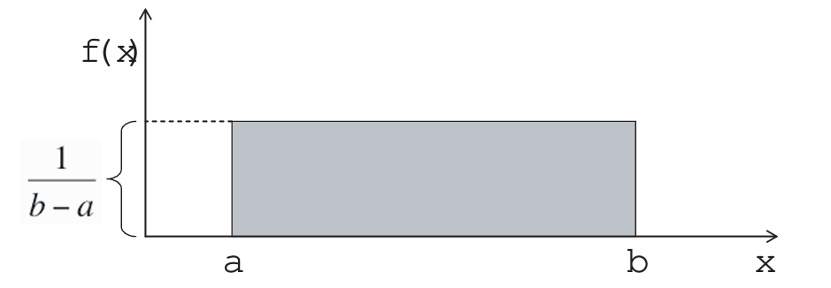
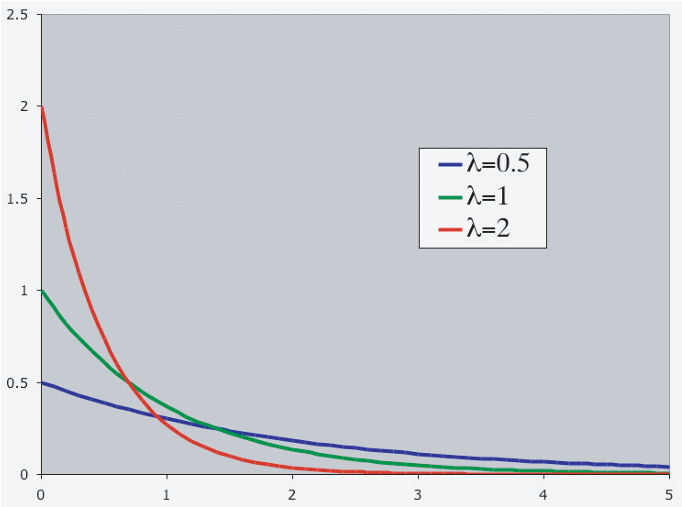

# Uniform and Exponential Probability Distributions {#ch10}

::: callout-note
### Learning objectives

By the end of this chapter, you should be able to:

-   distinguish between discrete and continuous random variables,
-   explain why $P(X = x) = 0$ for continuous variables,
-   define and interpret a probability density function (p.d.f.),
-   compute probabilities under the uniform distribution,
-   understand the exponential distribution and its key properties,
-   calculate probabilities using the exponential model.
:::

In contrast to a **discrete random variable**, a **continuous random variable** can assume an uncountable number of values.

Because there are infinitely many possible values, the probability of any single point is zero:

$$
P(X = x) = 0.
$$

Instead, probabilities are defined over **intervals**, such as

$$
P(x_1 \le X \le x_2), \quad x_1 < x_2.
$$

For this reason, continuous random variables are described by a **probability density function (p.d.f.)**, denoted $f(x)$.

For a function $f(x)$ defined on $a \le x \le b$ to be a valid p.d.f., two conditions must hold:

1.  $f(x) \ge 0$ for all $x$ in $[a,b]$\
2.  The total area under the curve equals 1:

$$
\int_a^b f(x)\,dx = 1.
$$

------------------------------------------------------------------------

## The Uniform Distribution

The **uniform distribution** (also called the rectangular distribution) is the simplest continuous model.

Its probability density function is:

$$
f(x) = \frac{1}{b-a}, \quad a \le x \le b,
$$

and $f(x) = 0$ outside this interval.

{fig-align="center" width="50%"}

Because the density is constant, probabilities are simply areas of rectangles.

To compute

$$
P(x_1 \le X \le x_2),
$$

we calculate:

$$
P(x_1 \le X \le x_2)
= (x_2 - x_1)\cdot \frac{1}{b-a}.
$$

::: callout-important
### Key intuition

Under a uniform distribution, **all values in the interval are equally likely**.
:::

The mean and variance are:

$$
E(X) = \frac{a+b}{2},
$$

$$
Var(X) = \frac{(b-a)^2}{12}.
$$

::: {.callout-note collapse="true"}
### Derivations of mean and variance for the Uniform Distribution (OPTIONAL)

Let $X$ be a continuous random variable following a uniform distribution, $X \sim U(a, b)$, with the probability density function (PDF): $$f(x) = \frac{1}{b-a}, \quad a \le x \le b$$

#### 1. Derivation of the Mean $E(X)$ {.unnumbered}

The expected value is defined as $E(X) = \int_{a}^{b} x f(x) \, dx$.

$$
\begin{aligned}
E(X) &= \int_{a}^{b} x \left( \frac{1}{b-a} \right) dx \\
&= \frac{1}{b-a} \left[ \frac{x^2}{2} \right]_{a}^{b} \\
&= \frac{1}{b-a} \left( \frac{b^2 - a^2}{2} \right) \\
&= \frac{1}{b-a} \frac{(b-a)(b+a)}{2} & \text{Using difference of squares} \\
E(X) &= \frac{a+b}{2}
\end{aligned}
$$

------------------------------------------------------------------------

#### 2. Derivation of the Variance $\text{Var}(X)$ {.unnumbered}

We use the identity $\text{Var}(X) = E(X^2) - [E(X)]^2$. First, we calculate $E(X^2)$:

$$
\begin{aligned}
E(X^2) &= \int_{a}^{b} x^2 \left( \frac{1}{b-a} \right) dx \\
&= \frac{1}{b-a} \left[ \frac{x^3}{3} \right]_{a}^{b} \\
&= \frac{b^3 - a^3}{3(b-a)} \\
&= \frac{(b-a)(b^2 + ab + a^2)}{3(b-a)} & \text{Using difference of cubes} \\
E(X^2) &= \frac{a^2 + ab + b^2}{3}
\end{aligned}
$$

Now, substitute $E(X^2)$ and $[E(X)]^2$ into the variance formula:

$$
\begin{aligned}
\text{Var}(X) &= \frac{a^2 + ab + b^2}{3} - \left( \frac{a+b}{2} \right)^2 \\
&= \frac{a^2 + ab + b^2}{3} - \frac{a^2 + 2ab + b^2}{4} \\
&= \frac{4(a^2 + ab + b^2) - 3(a^2 + 2ab + b^2)}{12} & \text{Common denominator of 12} \\
&= \frac{4a^2 + 4ab + 4b^2 - 3a^2 - 6ab - 3b^2}{12} \\
&= \frac{a^2 - 2ab + b^2}{12} \\
\text{Var}(X) &= \frac{(b-a)^2}{12}
\end{aligned}
$$
:::

------------------------------------------------------------------------

## The Exponential Distribution

Another important continuous model is the **exponential distribution**, often used for waiting-time problems.

Its probability density function is:

$$
f(x) = \lambda e^{-\lambda x}, \quad x \ge 0,
$$

where:

-   $\lambda > 0$ is the **rate parameter**,\
-   $e \approx 2.71828$.

{fig-align="center" width="60%"}

The exponential distribution is commonly used to model:

-   time until a job is found,
-   time until equipment failure,
-   waiting time between arrivals,
-   lifetime of components,
-   other “time-to-event” phenomena.

------------------------------------------------------------------------

### Mean and standard deviation

A particularly convenient property is:

$$
E(X) = \frac{1}{\lambda}, \qquad
SD(X) = \frac{1}{\lambda}.
$$

Thus, for the exponential distribution, the mean and standard deviation are equal.

Smaller values of $\lambda$ imply a flatter curve and a larger expected waiting time.

::: {.callout-note collapse="true"}
### Derivations of the mean and variance for the Exponential Distribution (OPTIONAL)

Let $X$ be a continuous random variable following an exponential distribution, $X \sim \text{Exp}(\lambda)$, with the probability density function (PDF): $$f(x) = \lambda e^{-\lambda x}, \quad x \ge 0$$

#### 1. Derivation of the Mean $E(X)$ {.unnumbered}

The expected value is defined as $E(X) = \int_{0}^{\infty} x f(x) \, dx$. We solve this using integration by parts, where $\int u \, dv = uv - \int v \, du$.

Let $u = x \implies du = dx$ and $dv = \lambda e^{-\lambda x} \, dx \implies v = -e^{-\lambda x}$.

$$
\begin{aligned}
E(X) &= \int_{0}^{\infty} x (\lambda e^{-\lambda x}) \, dx \\
&= \left[ -x e^{-\lambda x} \right]_{0}^{\infty} - \int_{0}^{\infty} (-e^{-\lambda x}) \, dx \\
&= (0 - 0) + \int_{0}^{\infty} e^{-\lambda x} \, dx \\
&= \left[ -\frac{1}{\lambda} e^{-\lambda x} \right]_{0}^{\infty} \\
&= 0 - \left( -\frac{1}{\lambda} e^0 \right) \\
E(X) &= \frac{1}{\lambda}
\end{aligned}
$$

------------------------------------------------------------------------

#### 2. Derivation of the Variance $\text{Var}(X)$ {.unnumbered}

We use the identity $\text{Var}(X) = E(X^2) - [E(X)]^2$. To find $E(X^2)$, we perform integration by parts again.

Let $u = x^2 \implies du = 2x \, dx$ and $dv = \lambda e^{-\lambda x} \, dx \implies v = -e^{-\lambda x}$.

$$
\begin{aligned}
E(X^2) &= \int_{0}^{\infty} x^2 (\lambda e^{-\lambda x}) \, dx \\
&= \left[ -x^2 e^{-\lambda x} \right]_{0}^{\infty} - \int_{0}^{\infty} (-e^{-\lambda x}) 2x \, dx \\
&= 0 + 2 \int_{0}^{\infty} x e^{-\lambda x} \, dx \\
\end{aligned}
$$

Notice that the remaining integral is $\frac{2}{\lambda} \int_{0}^{\infty} x (\lambda e^{-\lambda x}) \, dx$, which is simply $\frac{2}{\lambda} E(X)$.

$$
\begin{aligned}
E(X^2) &= \frac{2}{\lambda} E(X) \\
&= \frac{2}{\lambda} \left( \frac{1}{\lambda} \right) = \frac{2}{\lambda^2}
\end{aligned}
$$

Finally, substitute into the variance formula:

$$
\begin{aligned}
\text{Var}(X) &= E(X^2) - [E(X)]^2 \\
&= \frac{2}{\lambda^2} - \left( \frac{1}{\lambda} \right)^2 \\
&= \frac{2}{\lambda^2} - \frac{1}{\lambda^2} \\
\text{Var}(X) &= \frac{1}{\lambda^2}
\end{aligned}
$$

Of course,

$$
\text{SD}(X) = \sqrt{\text{Var}(X)} =  \frac{1}{\lambda}
$$
:::

------------------------------------------------------------------------

## Cumulative probabilities

From calculus, we obtain the cumulative distribution function:

$$
P(X > x) = e^{-\lambda x}.
$$

Therefore,

$$
P(X < x) = 1 - e^{-\lambda x}.
$$

More generally,

$$
P(x_1 < X < x_2)
= P(X < x_2) - P(X < x_1)
= e^{-\lambda x_1} - e^{-\lambda x_2}.
$$

::: callout-note
### Memoryless property

The exponential distribution has a special feature called the **memoryless property**:

$$
P(X > s+t \mid X > s) = P(X > t).
$$

The remaining waiting time does not depend on how long you have already waited.
:::

## Worked Example: Exponential Waiting Time

Suppose the waiting time (in hours) until a machine fails follows an exponential distribution with rate

$$
\lambda = 0.5.
$$

This means the average failure rate is 0.5 per hour.

**Step 1: Find the mean waiting time**

For an exponential distribution,

$$
E(X) = \frac{1}{\lambda}.
$$

Therefore,

$$
E(X) = \frac{1}{0.5} = 2 \text{ hours}.
$$

So on average, the machine lasts 2 hours before failing.

**Step 2: Probability the machine lasts more than 3 hours**

We use the survival function:

$$
P(X > x) = e^{-\lambda x}.
$$

Thus,

$$
P(X > 3) = e^{-0.5 \cdot 3}
= e^{-1.5}.
$$

Using a calculator,

$$
e^{-1.5} \approx 0.2231.
$$

So there is about a **22.3%** chance the machine lasts longer than 3 hours.

**Step 3: Probability the machine fails within 1 hour**

We use

$$
P(X < x) = 1 - e^{-\lambda x}.
$$

Hence,

$$
P(X < 1) = 1 - e^{-0.5 \cdot 1}
= 1 - e^{-0.5}.
$$

Since

$$
e^{-0.5} \approx 0.6065,
$$

we get

$$
P(X < 1) = 1 - 0.6065 = 0.3935.
$$

So there is about a **39.4%** chance the machine fails within 1 hour.

**Step 4: Demonstrating the memoryless property**

Suppose the machine has already survived 2 hours.\
What is the probability it survives **2 more hours**?

Using the memoryless property:

$$
P(X > 4 \mid X > 2) = P(X > 2).
$$

Now compute:

$$
P(X > 2) = e^{-0.5 \cdot 2}
= e^{-1}
\approx 0.3679.
$$

Notice something remarkable:

The probability of surviving 2 more hours **does not depend** on the fact that it already survived 2 hours.

That is the memoryless property in action.

::: callout-important
### Chapter summary

Continuous random variables assign probability to intervals rather than individual points.

In this chapter, we introduced:

-   the defining properties of probability density functions,
-   the uniform distribution, where all values in an interval are equally likely,
-   the exponential distribution, a fundamental model for waiting times.

These distributions play important roles in economics, reliability analysis, and queueing theory.
:::

------------------------------------------------------------------------

## Exercises

### Job Search Duration (Exponential Model)

Suppose the time (in months) it takes a job seeker to find employment follows an exponential distribution with rate $\lambda = 0.25$.

(a) What is the expected duration of unemployment?

(b) What is the probability the individual remains unemployed for more than 6 months?

(c) What is the probability the individual finds a job within 3 months?

(d) Suppose the individual has already been unemployed for 4 months. What is the probability they remain unemployed for at least 2 more months? Explain your answer economically.

------------------------------------------------------------------------

### Machine Breakdowns (Exponential Model)

A factory machine breaks down according to an exponential distribution with mean lifetime of 5 years.

(a) What is the value of $\lambda$?

(b) What is the probability the machine lasts more than 8 years?

(c) What is the probability the machine fails between years 2 and 4?

(d) If the machine has already lasted 5 years, does its expected remaining lifetime increase, decrease, or stay the same? Briefly explain.

------------------------------------------------------------------------

### Uniform Distribution: Consumer Willingness to Pay

Suppose consumers’ willingness to pay (WTP) for a product is uniformly distributed between \$10 and \$50.

(a) What is the mean willingness to pay?

(b) If the firm sets a price of \$30, what fraction of consumers will purchase the product?

(c) What price would ensure exactly 25% of consumers buy?

(d) Interpret economically what it means that the distribution is uniform.

------------------------------------------------------------------------

### Arrival of Customers (Exponential Waiting Time)

Customers arrive at a café according to an exponential waiting time distribution with mean waiting time of 10 minutes.

(a) What is the arrival rate per minute?

(b) What is the probability that the next customer arrives within 5 minutes?

(c) What is the probability that the café experiences a waiting time longer than 15 minutes?

(d) Why is the exponential distribution appropriate for modeling arrival times?

------------------------------------------------------------------------

### Comparing Models (Conceptual)

For each situation below, indicate whether a **uniform** or **exponential** distribution would be more appropriate. Justify briefly.

(a) The time until the next earthquake.

(b) The resale price of used textbooks uniformly discounted between 40% and 60%.

(c) The time until a randomly chosen unemployed worker finds a job.

(d) The location of a buyer’s ideal price within a fixed bargaining range.

------------------------------------------------------------------------

::: callout-important
### Big Picture Reflection

In applied economics, probability models are not chosen randomly.

-   The **uniform distribution** models situations with equal likelihood within a fixed range.
-   The **exponential distribution** models waiting times and rare, memoryless events.

Understanding the economic mechanism helps determine the correct probabilistic model.
:::
