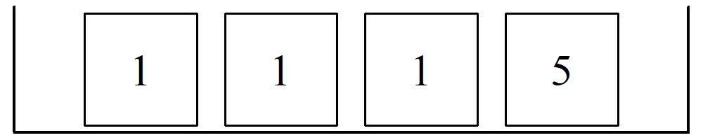
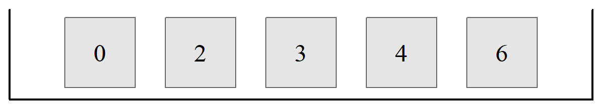
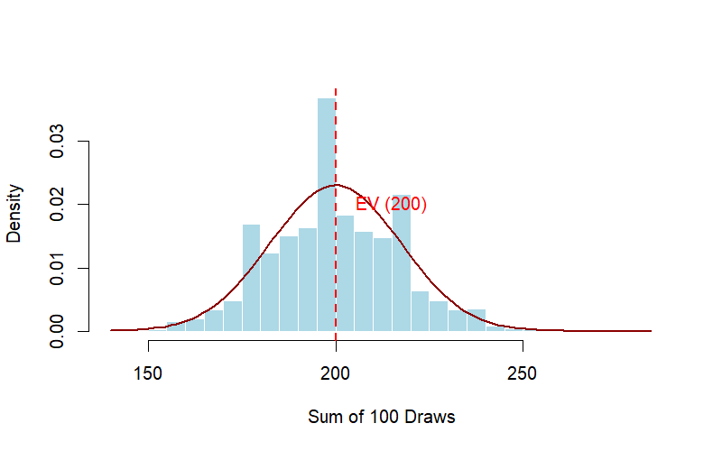

# The Expected Value and Standard Error {#ch11}

This chapter introduces the fundamental concepts of random processes and their sampling distributions. To keep these ideas manageable, we will motivate them through practical examples and the "Box Model" abstraction.

::: callout-note
### Learning objectives

By the end of this chapter, you will be able to:

-   Model random processes using the **Box Model** framework.
-   Calculate the **Expected Value (EV)** for a sum of random draws.
-   Apply the **Square Root Law** to determine the **Standard Error (SE)**.
-   Distinguish between the Standard Deviation (SD) of a population and the Standard Error (SE) of a sample.
-   Describe the characteristics of a **Sampling Distribution**.
:::

## Expected Value (EV)

The expected value represents the average value we anticipate from a random process over many repetitions.

### Example 1: 100 Draws

Assume 100 draws are made randomly with replacement from a box containing 4 tickets labeled 1, 1, 1, and 5.

```{r}
#| echo: false
#| results: hide
#| include: false

draw_and_save_box_1115 <- function(filename = "figs/ch11/EV_1.png") {
  
  # Ensure output directory exists
  dir.create(dirname(filename), recursive = TRUE, showWarnings = FALSE)
  
  # Open PNG device
  png(filename, width = 1000, height = 200, res = 150)
  
  # Remove margins
  par(mar = c(0, 0, 0, 0))
  
  # Labels inside boxes
  labels <- c("1", "1", "1", "5")
  
  # Empty plot region
  plot(NA, NA,
       type = "n",
       xlim = c(0, 5),
       ylim = c(0.15, 1.15),
       axes = FALSE,
       xlab = "",
       ylab = "",
       xaxs = "i",
       yaxs = "i",
       asp = 1)
  
  # Draw tray
  segments(x0 = c(0.1, 0.1, 4.9),
           y0 = c(1.1, 0.2, 0.2),
           x1 = c(0.1, 4.9, 4.9),
           y1 = c(0.2, 0.2, 1.1),
           lwd = 3)
  
  # Draw four square tickets
  for (i in 1:4) {
    rect(i - 0.4, 0.25, i + 0.4, 1.05, lwd = 2)
    text(i, 0.65, labels = labels[i], cex = 2.5, family = "serif")
  }
  
  # Close device
  dev.off()
}

# Execution
# draw_and_save_box_1115("figs/ch11/EV_1.png")
```

{fig-align="center" width="50%"}

What would be the expected sum of the 100 draws? On average, we expect the ticket labeled "1" to be picked 75 times and the ticket labeled "5" to be picked 25 times.

$$\text{Expected Sum} = (1 \times 75) + (5 \times 25) = 200$$

A more efficient way to calculate the **Expected Value (EV)** for the sum of draws made at random with replacement is:

$$EV_{\text{sum}} = \text{Average of Box} \times n
$$ {#eq-ev-sum}

------------------------------------------------------------------------

## The Standard Error and Square Root Law

In reality, if we were to actually draw 25 numbers from a box, the actual sum would likely differ from the expected value due to **chance error**.

$$
\text{Actual Sum} = \text{Expected Value} + \text{Chance Error}
$$

::: callout-tip
### Insight

Statistics is the art and science of modeling uncertainty. In the equation above, uncertainty is represented by the chance error.
:::

To quantify the likely size of this error, we use the **Standard Error (SE)**. For the sum of draws made at random with replacement, the SE is calculated using the **Square Root Law**:

$$
SE_{\text{sum}} = \sqrt{n} \times \text{SD of Box}
$$ {#eq-se-sum}

### Example 2: 25 Draws

Consider 25 draws from a box containing tickets \[0, 2, 3, 4, 6\].

```{r}
#| echo: false
#| results: hide
#| include: false

draw_and_save_box_02346 <- function(filename = "figs/ch11/EV_2.png") {

  # Ensure directory exists
  # dir.create(dirname(filename), recursive = TRUE, showWarnings = FALSE)

  # Open PNG device
  png(filename, width = 1200, height = 220, res = 150)

  # Remove margins
  par(mar = c(0,0,0,0))

  # Ticket labels
  labels <- c("0", "2", "3", "4", "6")

  # Empty plotting canvas
  plot(0,0,
       type="n",
       xlim=c(0,6),
       ylim=c(0.15,1.15),
       axes=FALSE,
       xaxs="i",
       yaxs="i",
       asp=1)

  # Draw tray (U-shaped container)
  segments(
    x0=c(0.1,0.1,5.9),
    y0=c(1.1,0.2,0.2),
    x1=c(0.1,5.9,5.9),
    y1=c(0.2,0.2,1.1),
    lwd=3
  )

  # Draw tickets
  for(i in 1:5){

    rect(
      i - 0.35,
      0.32,
      i + 0.35,
      1.02,
      col = NA,
      border = "gray40",
      lwd = 1.5
    )

    text(
      i,
      0.67,
      labels = labels[i],
      family = "serif",
      cex = 2
    )
  }

  dev.off()
}

# Execute
# draw_and_save_box_02346()
```

{fig-align="center" width="50%"}

For this box, the Average is 3 and the SD is 2. For $n = 25$ draws:

-   $EV_{\text{sum}} = 3 \times 25 = 75$
-   $SE_{\text{sum}} = \sqrt{25} \times 2 = 10$

**Interpretation:** The sum of the 25 draws should be 75, give or take 10 or so.

::: callout-important
### SD vs. SE

It is vital to distinguish between these two:

-   **Standard Deviation (SD)** applies to a list of numbers (the population in the box).
-   **Standard Error (SE)** applies to the chance variability of a sample statistic (like the sum of draws).
:::

------------------------------------------------------------------------

## Sampling Distribution

A **sampling distribution** is not a distribution of individual tickets in a box; rather, it is a distribution of a **statistic** (like a sum or an average) calculated from many different random samples.

Key characteristics include:

1.  **Repeated Sampling:** If we calculate $SUM_1, SUM_2, \dots$ from many different random samples, these sums form a histogram.
2.  **Central Limit Theorem (CLT):** This sampling distribution will follow a normal distribution as $n$ increases. Even if your box only contains "1"s and "5"s, the sampling distribution will tend towards looking like the smooth bell curve.
3.  **Parameters:** Since the sampling distribution tends towards a normal distribution, we need only its mean (**EV**) and its spread (**SE**) to fully characterize it.

### The Conceptual Process (Monte-Carlo Simulation)

To visualize how a sampling distribution is constructed, imagine following these three steps repeatedly:

1.  **Draw**: Take a random sample of size $n$ with replacement from your box.
2.  **Calculate**: Sum the values of the tickets you drew (call this $SUM_1$).
3.  **Repeat**: Repeat the process hundreds of times to get $SUM_2, SUM_3, \dots, SUM_{10,000}$.

If you create a histogram of these 10,000 different sums, you are looking at the **sampling distribution of the sum**.[^ch11-1]

[^ch11-1]: Actually you are supposed to repeat this infinite number of times.

### Connection to the Central Limit Theorem (CLT)

The most powerful tool in statistics is the **Central Limit Theorem**. It tells us that regardless of the shape of the original box (even if the box is highly skewed), the sampling distribution of the sum will begin to look like a **Normal Curve** as the number of draws ($n$) increases.

::: callout-important
### Two Parameters characterize the Sampling Distribution

Because the sampling distribution is Normal, it is entirely defined by the two parameters we calculated earlier:

1.  **Center**: It is centered at the **Expected Value (EV)**.
2.  **Spread**: The width of the sampling distribution is measured by the **Standard Error (SE)**.
:::

------------------------------------------------------------------------

### Visualization: The Effect of Sample Size

As $n$ (the number of draws) increases, two things happen to the **sampling distribution of sums**:

-   **The Center Moves**: Since $EV = \text{Average of Box} \times n$, the center of the distribution shifts to the right.[^ch11-2]
-   **The Spread Increases**: With larger smaple size, the **standard error of sums** will increase by the **square root law** -- that is, increasing the sample size, by say, **four** times will result in an increase of the standard error by **two** (or *square root of four*) times.  

[^ch11-2]: We are assuming nonnegative numbers in the box and at least one greater than zero. Or if we have some tickets with negative numbers, their mean should be greater than zero.

------------------------------------------------------------------------

### Summary of Notation

| Term        | Applies to...          | Calculated as...                   |
|-------------|------------------------|------------------------------------|
| **Average** | The Box (Population)   | Sum of labels / Number of tickets  |
| **SD**      | The Box (Population)   | Root-mean-square of deviations     |
| **EV**      | The Sample (Statistic) | $n \times \text{Average of Box}$   |
| **SE**      | The Sample (Statistic) | $\sqrt{n} \times \text{SD of Box}$ |

------------------------------------------------------------------------

### Simulating the sampling distribution

Let's return to Example 1 with the box-and-ticket model \[1,1,1,5\]. To see how the Expected Value (EV) and Standard Error (SE) emerge from random chance, we can simulate the process using any software. Instead of calculating the sum of 100 draws once, we repeat the entire experiment 10,000 times. Then by plotting these 10,000 sums, we acan draw the Sampling Distribution. You will notice two key insights from the simulation:

-   The Bell Curve: Even though our box only contains two types of tickets (1 and 5), the distribution of the sums takes on the characteristic bell shape of a Normal distribution. This is the Central Limit Theorem in action.
-   Predictability: The center of the histogram aligns precisely with our calculated EV (200), and the spread of these sums from different samples reflects our calculated SE (17.32).

```{r}
#| label: fig-sampling-dist-sim
#| echo: false
#| message: false
#| warning: false
#| include: false

# 1. Define the Box [1, 1, 1, 5]
box <- c(1, 1, 1, 5)
n_draws <- 100
n_simulations <- 10000

# 2. Run simulation
set.seed(1234)
sample_sums <- replicate(n_simulations, sum(sample(box, n_draws, replace = TRUE)))

# 3. Calculate Parameters
box_avg <- 2.0
box_sd  <- 1.732
ev      <- n_draws * box_avg
se      <- sqrt(n_draws) * box_sd

# 4. Save the figure
if(!dir.exists("figs/ch11")) dir.create("figs/ch11", recursive = TRUE)
png("figs/ch11/sampling_dist.png", width = 800, height = 500, res = 120)

hist(sample_sums, breaks = 30, probability = TRUE, 
     main = "", xlab = "Sum of 100 Draws", col = "lightblue", border = "white")

x_vals <- seq(min(sample_sums), max(sample_sums), length = 100)
lines(x_vals, dnorm(x_vals, mean = ev, sd = se), col = "darkred", lwd = 2)
abline(v = ev, col = "red", lty = 2, lwd = 2)
text(ev + 15, 0.02, "EV (200)", col = "red")

dev.off()
```

{#fig-sampling-dist-sim fig-align="center" width="70%"}

::: callout-tip
### Try this

For the same box-and-ticket model above, run the simulation with sample size 400, and find the expected value and standard error.

> In excel you can use the command `=+CHOOSE(RANDBETWEEN(1,4),1,1,1,5)`

Make sure to observe what happens to the espected value and standard errors. Make sure you can see the **Square Root Law** at work!  
:::

------------------------------------------------------------------------

## Chapter Summary

-   The **Box Model** helps us visualize population parameters.
-   The **Expected Value (EV)** predicts the average outcome of a random process.
-   The **Standard Error (SE)** measures the likely magnitude of the chance error.
-   According to the **Square Root Law**, the SE of a sum grows with $\sqrt{n}$, meaning it increases slower than the number of draws itself.

------------------------------------------------------------------------

## Exercises: Expected Value and the Standard Error

In the following exercises we explore how expected value and the standard error help us understand the outcomes of repeated random events.

::: callout-note
## Reminder

When a random experiment is repeated many times:

-   The **expected value** predicts the average outcome.
-   The **standard error** measures how much the total typically fluctuates around that expectation.
-   For independent draws,

$$
SE(\text{sum}) = \sqrt{n} \times SD(\text{one draw})
$$

This is the **square-root law**.
:::

------------------------------------------------------------------------

### Conceptual questions

### 1. Betting on a Single Number {.unnumbered}

Suppose you bet **Baht 100** on a single number.

-   If you win, you receive **your 100 back plus 200 more**.
-   If you lose, you lose your **100 Baht stake**.
-   The probability of winning is **1 in 4**.

If you make this bet **100 times**, about how much do you expect to **win or lose** in total? Explain your reasoning.

### 2. The Square-Root Law {.unnumbered}

If you quadruple the number of draws, $n$, from a box, what happens to the **standard error of the sum**?

a)  It doubles.\
b)  It quadruples.\
c)  It stays the same.

Explain your answer briefly.

### 3. Interpreting Standard Error {.unnumbered}

A gambling game has an expected value of $0$ and a standard error of $20$ for **100 plays**.

If a player plays 100 times, is it unusual for them to be **down \$50**? Explain using the **empirical rule**.

------------------------------------------------------------------------

### Guided practice

### 4. The 100-Draw Box {.unnumbered}

A box contains the tickets

$$
[0,\;0,\;0,\;0,\;8].
$$

You draw **100 times with replacement**.

a)  Calculate the **average** and **SD** of the box.\
b)  Calculate the **expected value** of the sum of the draws.\
c)  Calculate the **standard error** of the sum of the draws.

::: callout-tip
For a box model question, it is often helpful to proceed in this order:

1.  Find the **average of the box**.
2.  Find the **SD of the box**.
3.  Use $$
    EV(\text{sum}) = n \times \text{Average of box}
    $$
4.  Use $$
    SE(\text{sum}) = \sqrt{n} \times SD(\text{box})
    $$
:::

------------------------------------------------------------------------

### Box models and repeated draws

### 5. Repeated Draws from a Box {.unnumbered}

One hundred draws are made **with replacement** from the box

$$
1,\;1,\;2,\;2,\;2,\;4
$$

### (a)

What is the **smallest possible sum** of the 100 draws?

What is the **largest possible sum**?

### (b)

The expected sum of the draws will be around

\[ \_\_\_ \]

give or take

\[ \_\_\_ \]

or so.

### (c)

The chance that the sum will be **greater than 250** is almost

\[ \_\_\_ %. \]

### 6. Another Box of Tickets

One hundred draws are made **with replacement** from the box

$$
0,\;2,\;3,\;4,\;6
$$

### (a)

How **small** can the sum be?

How **large** can it be?

### (b)

How likely is the sum to lie between **370 and 430**?

Explain briefly.

------------------------------------------------------------------------

### Choosing between risky options

### 7. Choosing How Many Draws to Make {.unnumbered}

You can draw either **10 times with replacement** from the box

$$
1,\;-1
$$

You win **Baht 100** if certain conditions are met.

How many draws should you make?

### (a)

You win if the **sum equals 5**, and nothing otherwise.

### (b)

You win if the **sum is −5 or less**, and nothing otherwise.

### (c)

You win if the **sum lies between −5 and 5**, and nothing otherwise.

*No calculations are necessary, but explain your reasoning.*

### 8. Choosing Between Two Games {.unnumbered}

A box contains **10 tickets**, each marked with a whole number between **−5 and 5**.

The numbers are not all the same, but the **average of the box is 0**.

You have two choices:

#### Game A

Draw **100 times** with replacement.

You win **Baht 100** if the sum is between **−15 and 15**.

#### Game B

Draw **200 times** with replacement.

You win **Baht 100** if the sum is between **−30 and 30**.

Which option gives the **better chance of winning**?

a)  A gives a better chance of winning.\
b)  B gives a better chance of winning.\
c)  A and B give the same chance of winning.\
d)  Cannot tell without the SD of the box.

Explain your reasoning.

------------------------------------------------------------------------

### Standard error in familiar settings

### 9. Rolling Dice {.unnumbered}

A die is rolled **60 times**.

### (a)

The **total of the spots** should be around

\[ \_\_\_ \]

give or take

\[ \_\_\_ \]

or so.

### (b)

The number of **6's** should be around

\[ \_\_\_ \]

give or take

\[ \_\_\_ \]

or so.

### 10. Tossing a Coin {.unnumbered}

A coin is tossed **100 times**.

### (a)

Find the **expected number of heads**.

### (b)

Find the **standard error** for the number of heads.

### (c)

Estimate the chance that the number of heads is **between 40 and 60**.

### 11. Counting a Particular Ticket {.unnumbered}

One hundred draws are made **with replacement** from a box containing several tickets, including tickets marked **5**.

What is the chance of getting **between 8 and 32 tickets marked “5”**?

Explain briefly.

------------------------------------------------------------------------

### Challenging questions

### 12. Explaining the Square-Root Law {.unnumbered}

Suppose a box has average **0** and standard deviation **2**.

If you make **400 draws with replacement**:

a)  What is the **expected sum**?\
b)  What is the **standard error of the sum**?

Explain clearly how the **square-root law** determines your answer.

### 13. Simulation Challenge (Optional)

Use **R** to simulate the following experiment:

-   Draw 100 times with replacement from the box\
    $$
    0,\;2,\;3,\;4,\;6
    $$
-   Repeat the experiment **10,000 times**

Estimate the probability that the **sum lies between 370 and 430**.


Below is code you can use:

```r
box <- c(0, 2, 3, 4, 6)

sums <- replicate(10000, sum(sample(box, 100, replace = TRUE)))

mean(sums >= 370 & sums <= 430)
```

And if you prefer Python:

```python
import numpy as np

# Define the box
box = np.array([0, 2, 3, 4, 6])

# Replicate sampling and summing
sums = [np.sum(np.random.choice(box, 100, replace=True)) for _ in range(10000)]

# Compute the proportion of sums between 370 and 430
result = np.mean((np.array(sums) >= 370) & (np.array(sums) <= 430))

print(result)
```


