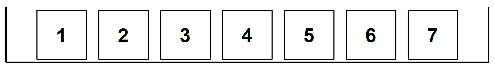

# The Accuracy of Averages   {#ch14}

## Learning objectives

By the end of this chapter, you should be able to:

- distinguish between an **estimator** and an **estimate**
- understand the concepts of **unbiasedness** and **efficiency**
- explain why sample averages vary across samples
- compute and interpret the **standard error of the mean**
- connect the standard error of sums to averages, counts, and percentages

---

## Estimators and estimates

The goal of statistical inference is to learn about a population using a sample.

However, it is important to distinguish between:

- an **estimator**: a rule or formula used to estimate a population parameter  
- an **estimate**: the numerical value obtained from applying that rule  

::: {.callout-note title="Key idea"}
An estimator is a **method** or **rule**.  
An estimate is a **number**.
:::

For example, the sample mean

$$
\bar{X} = \frac{1}{n}\sum X_i
$$

is an estimator of the population mean $\mu$.

---

### What makes a good estimator?

Two important properties:

#### 1. Unbiasedness

An estimator is **unbiased** if, on average, it equals the true population value.

::: {.callout-note title="Key idea"}
The sample mean is an unbiased estimator of the population mean.
:::

In contrast, some estimators are biased. For example, the naive variance formula:

$$
\frac{1}{n}\sum (X - \bar{X})^2
$$

underestimates the true population variance.

---

#### 2. Efficiency

Even among unbiased estimators, some are better than others.

An estimator is **efficient** if it has **smaller variability** across samples.

::: {.callout-tip title="Intuition"}
A good estimator is not only correct on average, but also **stable** across samples.
:::

---

### Sampling variation

Even with a good estimator, different samples give different results.

This is called **sampling variation**.

The key question becomes:

> How much does the sample mean typically vary?

The answer is given by the **standard error (SE)**.

---

## Sampling distribution of the mean

We now study how averages behave when we repeatedly draw samples.

## The box model

Consider a box with 7 tickets:

```{r}
#| label: fig-box-1-to-7
#| message: false
#| warning: false
#| fig-cap: A box with 7 tickets labelled 1 to 7
#| include: false

draw_box_1_to_7 <- function(filename = NULL) {
  par(mar = c(0, 0, 0, 0))
  
  labels <- 1:7
  
  plot(0, 0, type = "n", 
       xlim = c(0, 8), ylim = c(0.15, 1.15),
       axes = FALSE, xaxs = "i", yaxs = "i", asp = 1)
  
  for (i in 1:7) {
    rect(i - 0.4, 0.25, i + 0.4, 1.05, lwd = 2)
    text(i, 0.65, labels = labels[i], cex = 2.2, font = 2)
  }
  
  segments(
    x0 = c(0.1, 0.1, 7.9),
    y0 = c(1.1, 0.2, 0.2),
    x1 = c(0.1, 7.9, 7.9),
    y1 = c(0.2, 0.2, 1.1),
    lwd = 3
  )
}

# draw_box_1_to_7()

# --- SAVE FILE ---
draw_box_1_to_7("figs/ch14/box_1_7.png")
```

{fig-align="center" width="60%"}

The average of the box is:

$$
\frac{1+2+3+4+5+6+7}{7} = 4
$$

---

### Sampling from the box

Suppose we take 25 draws (with replacement).

Example 1:

* Sum = 105
* Average = 4.2

Example 2:

* Sum = 95
* Average = 3.8

Different samples give different averages.

---

::: {.callout-note title="Key idea"}
The sample average varies from sample to sample, but it is centered around the population mean.
:::

---

### Standard error of the average

We want a “give-or-take” number for the average.

::: {.callout-note title="Key formula"}
The standard error of the average is:

$$
SE(\text{average}) = \frac{SD(\text{box})}{\sqrt{n}}
$$
:::

---

So start with the **sum**:

* SD of box = 2
* Number of draws = 25

$$
SE(\text{sum}) = \sqrt{n} \times SD = 5 \times 2 = 10
$$

Then divide by the sample size, n:

$$
SE(\text{average}) = \frac{10}{25} = 0.4
$$

---

So in this example:

> Average = 4, give or take 0.4

## Simulation: Sampling Distribution of the Mean

To understand how the sample average behaves, we simulate repeated samples from the box.

```{r}
# Set seed for reproducibility
set.seed(123)

# Parameters
n <- 25          # sample size
n_sims <- 1000   # number of simulations

# Box with tickets 1 to 7
box <- 1:7

# Simulate sample means
means <- replicate(n_sims, {
  sample_draws <- sample(box, size = n, replace = TRUE)
  mean(sample_draws)
})

# Plot histogram
hist(
  means,
  breaks = 30,
  main = "Sampling Distribution of the Mean (n = 25)",
  xlab = "Sample Average",
  border = "white"
)

# Add true mean
abline(v = mean(box), lwd = 2)
```


::: {.callout-note title="Key insight"}
Even though individual draws are spread out, the **average is tightly concentrated** around the population mean.
:::

## What happens if we increase the sample size?

As with the **sum** and the **percentage**, we can ask what happens to the expected value and standard error of the **average** when the sample size increases.

First, the expected value of the sample average does **not** depend on sample size. It remains equal to the population average.

However, the standard error becomes smaller as the sample size increases.

::: {.callout-tip title="The square-root law again"}
The larger the sample size, the smaller the standard error of the average. This means that the sample average is more likely to be close to the true population average.

If the sample size becomes $n$ times larger, the standard error falls by a factor of $\sqrt{n}$.
:::

Let's run the same code above, but this time with n=100.

### Simulation: Effect of Sample Size on the Mean

```{r}
#| echo: false
# Set seed for reproducibility
set.seed(123)

# Parameters
n_sims <- 1000
box <- 1:7
mu <- mean(box)
sigma <- sd(box)

# --- Simulation for n = 25 ---
n1 <- 25
means_25 <- replicate(n_sims, {
  mean(sample(box, size = n1, replace = TRUE))
})

# --- Simulation for n = 100 ---
n2 <- 100
means_100 <- replicate(n_sims, {
  mean(sample(box, size = n2, replace = TRUE))
})

# Common breaks and limits
x_min <- min(means_25, means_100)
x_max <- max(means_25, means_100)
breaks_seq <- seq(floor(x_min * 10) / 10, ceiling(x_max * 10) / 10, length.out = 31)

# Compute histogram objects first (without plotting)
h1 <- hist(means_25, breaks = breaks_seq, plot = FALSE)
h2 <- hist(means_100, breaks = breaks_seq, plot = FALSE)

# Compute normal curve heights
x_grid <- seq(min(breaks_seq), max(breaks_seq), length.out = 500)
y1 <- dnorm(x_grid, mean = mu, sd = sigma / sqrt(n1))
y2 <- dnorm(x_grid, mean = mu, sd = sigma / sqrt(n2))

# Set y-axis limit high enough for both histograms and curves
y_max <- max(h1$density, h2$density, y1, y2) * 1.08

# Plot first histogram (lighter grey)
hist(
  means_25,
  breaks = breaks_seq,
  freq = FALSE,
  xlim = c(min(breaks_seq), max(breaks_seq)),
  ylim = c(0, y_max),
  col = rgb(0.75, 0.75, 0.75, 0.5),
  border = "grey40",
  main = "Sampling Distribution of the Mean",
  xlab = "Sample Average"
)

# Overlay second histogram (darker grey)
hist(
  means_100,
  breaks = breaks_seq,
  freq = FALSE,
  col = rgb(0.30, 0.30, 0.30, 0.5),
  border = "grey20",
  add = TRUE
)

# Add vertical line for true mean
abline(v = mu, lwd = 2)

# Add theoretical normal curves
curve(
  dnorm(x, mean = mu, sd = sigma / sqrt(n1)),
  from = min(breaks_seq), to = max(breaks_seq),
  add = TRUE, lwd = 2, lty = 2
)

curve(
  dnorm(x, mean = mu, sd = sigma / sqrt(n2)),
  from = min(breaks_seq), to = max(breaks_seq),
  add = TRUE, lwd = 2
)

# Add legend
legend(
  "topright",
  legend = c("n = 25", "n = 100", "Normal curve (n = 25)", "Normal curve (n = 100)"),
  fill = c(rgb(0.75, 0.75, 0.75, 0.5), rgb(0.30, 0.30, 0.30, 0.5), NA, NA),
  border = c("grey40", "grey20", NA, NA),
  lty = c(NA, NA, 2, 1),
  lwd = c(NA, NA, 2, 2),
  bty = "n"
)
```

::: {.callout-note title="What to observe"}

- Both distributions are centered at the same value (the true mean = 4)
- The darker distribution (n = 100) is more tightly concentrated
- Increasing the sample size reduces the standard error
:::

---


## Which standard error?

There are four common operations:

1. Sum
2. Average
3. Count
4. Percentage

Each has its own standard error.

### Summary table

| Quantity   | Standard Error                      |
| ---------- | ----------------------------------- |
| Sum        | $\sqrt{n} \times SD$                |
| Average    | $SD / \sqrt{n}$                     |
| Count      | Same as sum (for 0–1 box)           |
| Percentage | $(SE(\text{count}) / n) \times 100$ |


::: {.callout-important title="Important"}
All standard errors come from one fundamental idea:

$$
SE(\text{sum}) = \sqrt{n} \times SD
$$

Everything else is derived from this.
:::

---

### Unknown SD: bootstrapping idea

In practice, the SD of the box is often unknown.

We estimate it using the sample:

$$
SD(\text{box}) \approx SD^+
$$

::: {.callout-note title="Bootstrapping"}
When the population SD is unknown, use the **sample SD** as an estimate.
:::


## From averages to confidence intervals

So far, we have learned how to describe the accuracy of an average using the **standard error**.

But in practice, we usually want to go one step further:

> We want to use the sample average to say something about the **unknown population mean**.

This is where **confidence intervals for averages** come in.

---

## From standard error to confidence interval

Recall:

$$
SE(\text{average}) = \frac{SD}{\sqrt{n}}
$$

This tells us the typical size of the sampling error.

Using the empirical rule:

- about 68% of sample averages fall within $\pm 1$ SE  
- about 95% fall within $\pm 2$ SE  
- about 99.7% fall within $\pm 3$ SE  

::: {.callout-note title="Key idea"}
A 95% confidence interval for the population mean is:

$$
\text{sample average} \pm 2 \times SE
$$
:::

---

### Worked example

Suppose:

- sample size: $n = 100$  
- sample average: $\bar{X} = 50$  
- sample SD: $SD^+ = 10$  

Then:

$$
SE = \frac{10}{\sqrt{100}} = 1
$$

So the 95% confidence interval is:

$$
50 \pm 2(1) = [48, 52]
$$

---

::: {.callout-tip title="Interpretation"}
We estimate that the population mean is between 48 and 52, with about 95% confidence.
:::

---

### Important interpretation

As before, we must be careful.

It is tempting to say:

> There is a 95% chance that the true mean lies between 48 and 52.

This is **not correct**.

---

::: {.callout-warning title="Common pitfall"}
The population mean is fixed.

The interval varies from sample to sample.
:::

---

The correct interpretation is:

> If we repeatedly took samples and constructed intervals in this way, about 95% of those intervals would contain the true mean.

---

### Simulation: confidence intervals for averages

Let us simulate this idea.

```{r}
set.seed(101)

n <- 100
n_sims <- 100
mu_true <- 50
sd_true <- 10

results <- data.frame(
  sample_id = 1:n_sims,
  mean = NA,
  lower = NA,
  upper = NA,
  covers = NA
)

for (i in 1:n_sims) {
  x <- rnorm(n, mean = mu_true, sd = sd_true)
  
  m <- mean(x)
  se <- sd(x) / sqrt(n)
  
  lower <- m - 2 * se
  upper <- m + 2 * se
  
  results$mean[i] <- m
  results$lower[i] <- lower
  results$upper[i] <- upper
  results$covers[i] <- (lower <= mu_true) & (upper >= mu_true)
}
```

How many intervals capture the true mean?

```{r}
sum(results$covers)
```

Let's plot the confidence intervals.

```{r}
#| echo: false
plot(
  x = NULL, y = NULL,
  xlim = range(c(results$lower, results$upper)),
  ylim = c(1, n_sims),
  xlab = "Value",
  ylab = "Sample",
  main = "95% confidence intervals for the mean"
)

for (i in 1:n_sims) {
  if (results$covers[i]) {
    segments(results$lower[i], i, results$upper[i], i)
    points(results$mean[i], i, pch = 16)
  } else {
    segments(results$lower[i], i, results$upper[i], i, lty = 2, lwd = 2)
    points(results$mean[i], i, pch = 1)
  }
}

abline(v = mu_true, lwd = 2)
```

::: {.callout-note title="How to read the figure"}
- Each horizontal line is a confidence interval
- The vertical line is the true population mean
- Most intervals cross the true value
- A few do not — this is expected
:::

---

## Chapter summary

* An **estimator** is a rule; an **estimate** is a number.
* Good estimators are **unbiased** and **efficient**.
* Sample averages vary due to **sampling variation**.
* The **standard error** measures the typical size of this variation.
* For averages:

$$
SE(\text{average}) = \frac{SD}{\sqrt{n}}
$$

* Larger samples lead to more precise estimates.
* All standard errors are derived from the SE of the sum.

::: {.callout-important title="Big picture"}
All statistical inference follows the same logic:

Estimate using a sample
Measure uncertainty using standard error
Construct a confidence interval
:::
Final insight

As sample size increases:

the standard error shrinks
confidence intervals become narrower
estimates become more precise

::: {.callout-tip title="Takeaway"}
More data does not change the truth — it improves how precisely we can estimate it.
:::

---

## Exercises

### 1. Draws from a box  {.unnumbered}

{fig-align="center" width="60%"}

Suppose 100 draws are made at random **with replacement** from the box shown above.

1. The average of the draws will be around `______`, give or take `______` or so.
2. Estimate the chance that the average of the draws will be **more than 4.2**.

Now suppose instead that **400 draws** are made at random with replacement from the same box.

3. The average of the draws will be around `______`, give or take `______` or so.
4. Estimate the chance that the average of the draws will be **more than 4.2**.

::: {.callout-note title="Hint"}
For draws made with replacement from a box:

- the expected value of the sample average is the **average of the box**
- the standard error of the sample average is

$$
SE(\text{average}) = \frac{SD(\text{box})}{\sqrt{n}}
$$

As the number of draws increases, the standard error gets smaller.
:::

---

### 2. Average age of university students  {.unnumbered}

A university has **30,000 students**. As part of a survey, **900 students** are chosen at random. The average age in the sample is **22.3 years**, and the sample standard deviation is **4.5 years**.

1. Estimate the average age of all 30,000 students.
2. Attach a “give-or-take” number to your estimate.
3. Construct an approximate **95% confidence interval** for the average age of all 30,000 students.

::: {.callout-note title="Hint"}
When the sample is large, the sample SD can be used to estimate the SD of the box.
:::

---

### 3. Is the claimed box average plausible?  {.unnumbered}

A total of **100 draws** are made at random with replacement from a box. The average of the draws is **102.7**, and the SD of the draws is **10**.

Someone claims that the average of the box is **100**.

1. Is that claim plausible? Explain.
2. Now suppose instead that the average of the draws is **101.1**, with the same SD of **10**. Is the claim that the box average is 100 more plausible in this case? Explain.

::: {.callout-important title="What to think about"}
Compare the observed sample average to the claimed box average using the standard error of the average. Ask: how many standard errors away is the observed result from the claim?
:::
