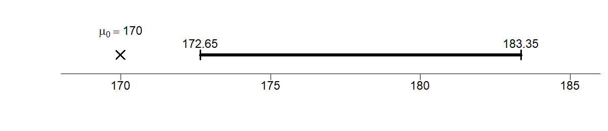
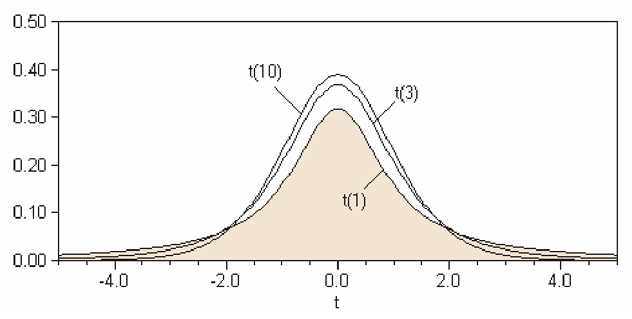
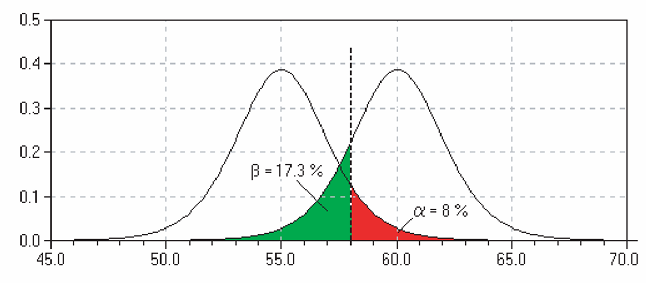

# Hypothesis Testing   {#ch15}

## Learning objectives

By the end of this chapter, you should be able to:

- formulate **null and alternative hypotheses**
- compute and interpret a **test statistic**
- understand and use **critical values** and **p-values**
- connect hypothesis testing with **confidence intervals**
- understadn what is meant by a **good estiator**
- understand when to use the **t-distribution**
- distinguish between **Type I and Type II errors**

---

In this chapter we put together everything we've discussed above into a formal method for testing hypothesis.

## Motivation: Should the new system be adopted?

A manager is considering introducing a new billing system.

She believes the system is worthwhile **only if the average monthly account exceeds \$170**.

A random sample of **400 accounts** is drawn, and the sample mean is **\$178**.  
Assume accounts are approximately normally distributed with **SD = \$65**.

> Can we conclude that the new system is cost-effective?

---

::: {.callout-note title="Key idea"}
We are not just asking whether the sample mean is above 170.

We are asking whether the difference could be explained by **chance variation**.
:::

---

Hypothesis testing can be broken into three essential
steps, namely, 1) setting up the hypothesis, 2) calculating the
test statistic, and 3) concluding.

## Step 1: Setting up the hypothesis

We begin by stating two competing hypotheses:

- $H_0$: $\mu = 170$  
- $H_a$: $\mu > 170$

---

::: {.callout-tip title="Interpretation"}
- The **null hypothesis** represents the “status quo” or no effect  
- The **alternative hypothesis** is what we are trying to find evidence for  
:::

---

::: {.callout-warning title="Common pitfall"}
We do not “prove” the alternative hypothesis.

We assess whether the data provide **strong evidence against the null**.
:::

---

## Step 2: The test statistic

We compute how far the observed value is from what the null states, measured in standard errors:

$$
\text{TS} = \frac{\text{observed} - \text{expected}}{SE}
$$

---

### Compute the standard error

Recall that we have four SEs (sum, count, percentage and average). We are talking about the "average" monthly accounts.

$$
SE(avg.) = \frac{SE(sum)}{n} = \frac{SD_{box}}{\sqrt{n}} = \frac{65}{\sqrt{400}} = \frac{65}{20} = 3.25
$$

---

### Compute the test statistic

$$
\text{TS} = \frac{178 - 170}{3.25} \approx 2.46
$$

---

::: {.callout-note title="Key idea"}
The test statistic tells us:

> How many standard errors away the sample mean is from the null hypothesis.
:::

---

## Step 3: How to conclude

We will now learn 3 ways to conclude, namely, the critical value method, the p-value method, and by constructing confidence
intervals. All 3 methods are intrinsically related.

---

### Method 1: Critical value method

::: {.callout-important title="Critical value method"}
The decision rule is

- Reject the null if |TS| > "critical value"
:::

For a **one-sided test** at the 5% significance level, from the standard normal table:

- critical value = **1.645**

Since:

$$
|2.46| > 1.645
$$

we reject the null.

```{r}
#| echo: false
# Increase bottom margin (key!)
par(mar = c(7, 4, 3, 1))

# Standard normal
x_vals <- seq(-3.5, 3.5, length.out = 600)
y_vals <- dnorm(x_vals)

z_crit <- 1.645
z_obs  <- 2.46

plot(
  x_vals, y_vals, type = "l", lwd = 2,
  xlab = "", ylab = "Density",
  main = "One-sided Test (5% level)",
  ylim = c(0, max(y_vals) * 1.15)
)

# Shade rejection region
x_fill <- seq(z_crit, max(x_vals), length.out = 300)
polygon(
  c(x_fill, rev(x_fill)),
  c(dnorm(x_fill), rep(0, length(x_fill))),
  col = "grey70", border = NA
)

lines(x_vals, y_vals, lwd = 2)

# -------------------------
# Axis ticks for CV and TS
# -------------------------
axis(
  1,
  at = c(z_crit, z_obs),
  labels = FALSE,
  tcl = -2.0,
  lwd.ticks = 1.5
)

# -------------------------
# Clean labels BELOW axis
# -------------------------
mtext("CV = 1.645", side = 1, at = z_crit, line = 2.0, cex = 0.9)
mtext("TS = 2.46",  side = 1, at = z_obs,  line = 2.8, cex = 0.9)

# -------------------------
# Annotation
# -------------------------
text(2.9, 0.08, "Rejection region (5%)", cex = 0.9)
```


The shaded region represents the rejection region for a one-sided test at the 5% level.  

The critical value is 1.645, meaning we reject the null if the test statistic exceeds this threshold.

In other words, since the observed test statistic (2.46) lies within the shaded region, we reject the null hypothesis.


---

### Method 2: p-value


```{r}
#| eval: false
#| include: false
mu0 <- 170
sigma <- 65
n <- 400
se <- sigma / sqrt(n)

set.seed(123)
sample_means <- rnorm(10000, mean = mu0, sd = se)
x_obs <- 178

hist(
  sample_means,
  breaks = 40,
  freq = FALSE,
  col = "grey85",
  border = "grey60",
  main = "Sampling Distribution Under the Null Hypothesis",
  xlab = "Sample mean",
  ylim = c(0, 0.14)
)

curve(
  dnorm(x, mean = mu0, sd = se),
  from = mu0 - 4 * se,
  to = mu0 + 4 * se,
  add = TRUE,
  lwd = 2
)

abline(v = mu0, lwd = 2)
abline(v = x_obs, lwd = 2, lty = 2)

x_fill <- seq(x_obs, mu0 + 4 * se, length.out = 300)
y_fill <- dnorm(x_fill, mean = mu0, sd = se)
polygon(
  c(x_fill, rev(x_fill)),
  c(y_fill, rep(0, length(y_fill))),
  col = "grey50",
  border = NA
)

legend(
  "topright",
  legend = c("Null mean = 170", "Observed mean = 178", "p-value area"),
  lwd = c(2, 2, NA),
  lty = c(1, 2, NA),
  fill = c(NA, NA, "grey50"),
  border = NA,
  bty = "n"
)
```

::: {.callout-important title="Critical value method"}
The decision rule is

- Reject the null if p-value < significance level $\alpha$
:::

The **p-value** is the probability of observing a result as extreme as this one, assuming the null is true.

Here, from the standard normal table:

$$
P(Z > 2.46) \approx 0.007
$$

::: {.callout-note title="Interpretation"}
A p-value of 0.007 means:

> There is only a 0.7% chance of observing such a large difference if the true mean were 170.
:::

Since:

$$
0.007 < 0.05
$$

we **reject the null hypothesis**.

```{r}
#| echo: false
par(mar = c(6, 4, 3, 1))   # extra bottom space

# Parameters
mu0 <- 170
sigma <- 65
n <- 400
se <- sigma / sqrt(n)
x_obs <- 178

# Grid
x_vals <- seq(mu0 - 4 * se, mu0 + 4 * se, length.out = 600)
y_vals <- dnorm(x_vals, mean = mu0, sd = se)

# Plot
plot(
  x_vals, y_vals, type = "l", lwd = 2,
  xlab = "", ylab = "Density",
  main = "P-value for a One-sided Test",
  ylim = c(0, max(y_vals) * 1.15)
)

# Shade p-value
x_fill <- seq(x_obs, max(x_vals), length.out = 300)
y_fill <- dnorm(x_fill, mean = mu0, sd = se)

polygon(
  c(x_fill, rev(x_fill)),
  c(y_fill, rep(0, length(y_fill))),
  col = "grey70",
  border = NA
)

# Curve on top
lines(x_vals, y_vals, lwd = 2)

# -------------------------
# MAIN AXIS (sample mean)
# -------------------------
axis(1)

# -------------------------
# SECOND AXIS (labels only)
# -------------------------
axis(
  side = 1,
  at = c(mu0, x_obs),
  labels = c(expression(mu[0]), "2.46"),
  line = 3,
  tcl = -0.7,
  lwd.ticks = 1.5
)

# -------------------------
# Annotation
# -------------------------
text(180.5, 0.025, expression(p-value == 0.007), cex = 0.95)
```

The p-value can also be calculated directly from the normal distribution:

```{r}
#| echo: true
z_stat <- (178 - 170) / 3.25
p_value <- 1 - pnorm(z_stat)

z_stat
p_value
```


So the observed sample mean is about **2.46 standard errors** above the null value, giving a p-value of about **0.007**.

::: {.callout-note title="What the figure shows"}
* The sampling distribution represents the sample means we would expect **if the null hypothesis were true**
* The shaded area to the right of thetest statistic of 2.46 is the **p-value**
* Because this area is very small, the observed result would be unlikely if the true mean were 170
:::

---

### Method 3: Confidence intervals

::: {.callout-note title="Decision rule"}
If the null value (170) is **not inside** the interval, reject the null.
:::

Construct a 90% confidence interval:

$$
178 \pm (1.645 \times 3.25) = [172.65, 183.35]
$$

```{r}
#| include: false
png("figs/ch15/ci_line.png", width = 1200, height = 260, res = 150)

par(mar = c(2.2, 4, 0.2, 0.5))

# Values
ci_lower <- 172.65
ci_upper <- 183.35
mu0 <- 170

# Empty plot
plot(
  NA, NA,
  xlim = c(168, 186),
  ylim = c(-0.18, 0.22),
  xlab = "", ylab = "",
  main = "",
  axes = FALSE,
  xaxs = "i",
  yaxs = "i"
)

# Custom bottom axis
axis_y <- -0.08
segments(168, axis_y, 186, axis_y)

ticks <- c(170, 175, 180, 185)
tick_len <- 0.025
segments(ticks, axis_y, ticks, axis_y - tick_len)

text(
  ticks, axis_y - 0.045,
  labels = c("170", "175", "180", "185"),
  cex = 0.9
)

# CI segment
segments(ci_lower, 0, ci_upper, 0, lwd = 4)

# Brackets
segments(ci_lower, -0.02, ci_lower, 0.02, lwd = 2)
segments(ci_upper, -0.02, ci_upper, 0.02, lwd = 2)

# Labels above brackets
text(ci_lower, 0.05, "172.65", cex = 0.9)
text(ci_upper, 0.05, "183.35", cex = 0.9)

# Null marker
points(mu0, 0, pch = 4, cex = 1.5, lwd = 2)
text(mu0, 0.10, expression(mu[0] == 170), cex = 0.9)

dev.off()
```

{fig-align="center" width="90%"}

Since the null of 170 is outside the interval, we reject the null.

---

### Summary

All three methods agree:

> There is strong evidence that the average monthly account exceeds \$170.

::: {.callout-important title="Managerial decision"}
The data suggest that the new billing system is likely to be **cost-effective**.
:::

---

## One-sided vs two-sided tests

- One-sided: $H_a: \mu > 170$  
- Two-sided: $H_a: \mu \neq 170$

::: {.callout-note title="Rule of thumb"}
Taking $\alpha$ as 5%:

- One-sided → place all $\alpha$ in one tail → critical value = 1.645  
- Two-sided → split $\alpha$ → critical value = 1.96  
:::

So, the same sample evidence can be interpreted differently depending on the alternative hypothesis.

- In a **one-sided test**, we ask whether the mean is **greater than** a benchmark:
  
  $$
  H_0:\mu = 170 \qquad H_a:\mu > 170
  $$

- In a **two-sided test**, we ask whether the mean is simply **different from** the benchmark:
  
  $$
  H_0:\mu = 170 \qquad H_a:\mu \neq 170
  $$

In both cases, the observed sample mean is 178, and the null distribution is centered at 170.

```{r}
#| echo: false
## Critical values: one-sided vs two-sided tests
# Set margins: extra room at bottom for the extra labels
par(mar = c(6, 4, 3, 1))

# Parameters
mu0 <- 170
sigma <- 65
n <- 400
se <- sigma / sqrt(n)

# Critical values (z)
z_crit_one <- 1.645
z_crit_two <- 1.96

# Convert to sample-mean scale
x_crit_one <- mu0 + z_crit_one * se
x_crit_two_upper <- mu0 + z_crit_two * se
x_crit_two_lower <- mu0 - z_crit_two * se

# Grid
x_vals <- seq(mu0 - 4 * se, mu0 + 4 * se, length.out = 600)
y_vals <- dnorm(x_vals, mean = mu0, sd = se)

# Plot
plot(
  x_vals, y_vals, type = "l", lwd = 2,
  xlab = "", ylab = "Density",
  main = "Critical Values (5% level)",
  ylim = c(-0.03, max(y_vals) * 1.15),
  axes = FALSE
)

# Main axes only
axis(1)
axis(2)

# -------------------------
# Shaded regions
# -------------------------

# One-sided rejection region
x_fill_one <- seq(x_crit_one, max(x_vals), length.out = 300)
y_fill_one <- dnorm(x_fill_one, mean = mu0, sd = se)
polygon(
  c(x_fill_one, rev(x_fill_one)),
  c(y_fill_one, rep(0, length(y_fill_one))),
  col = "grey75", border = NA
)

# Additional left tail for two-sided test
x_fill_left <- seq(min(x_vals), x_crit_two_lower, length.out = 300)
y_fill_left <- dnorm(x_fill_left, mean = mu0, sd = se)
polygon(
  c(x_fill_left, rev(x_fill_left)),
  c(y_fill_left, rep(0, length(y_fill_left))),
  col = "grey45", border = NA
)

# Additional right tail for two-sided test
x_fill_right <- seq(x_crit_two_upper, max(x_vals), length.out = 300)
y_fill_right <- dnorm(x_fill_right, mean = mu0, sd = se)
polygon(
  c(x_fill_right, rev(x_fill_right)),
  c(y_fill_right, rep(0, length(y_fill_right))),
  col = "grey45", border = NA
)

# Re-draw density curve on top
lines(x_vals, y_vals, lwd = 2)

# -------------------------
# Vertical lines
# -------------------------
abline(v = mu0, lwd = 2)
abline(v = x_crit_one, lwd = 2, lty = 3)
abline(v = x_crit_two_upper, lwd = 2, lty = 4)
abline(v = x_crit_two_lower, lwd = 2, lty = 4)

# -------------------------
# Null label
# -------------------------
text(
  x = mu0,
  y = -0.010,
  labels = expression("null (" * mu == 170 * ")"),
  xpd = TRUE
)

# -------------------------
# Extra critical-value labels at bottom
# -------------------------

# Row 1: ±1.96
text(
  x = c(x_crit_two_lower, x_crit_two_upper),
  y = -0.012,
  labels = c("-1.96", "        1.96"),
  xpd = TRUE,
  cex = 0.9
)

# Row 2: ±1.645
text(
  x = c(mu0 - z_crit_one * se, mu0 + z_crit_one * se),
  y = -0.023,
  labels = c("", "1.645"),
  xpd = TRUE,
  cex = 0.9
)

# -------------------------
# Legend
# -------------------------
legend(
  "topright",
  legend = c(
    "One-sided rejection region",
    "Additional (two-sided)"
  ),
  fill = c("grey75", "grey45"),
  border = NA,
  bty = "n",
  inset = 0.02
)
```

::: {.callout-note title="What the figure shows"}
* In the **one-sided test**, the rejection region is the area in the **right tail only**, from 1.645 onwards
* In the **two-sided test**, the rejection area includes **both tails**: either ends from -1.96 and 1.96
:::


> For our numerical example, the test statistic is 2.46, so in either case (whether one-sided or two-sided) we reject the null.

---

## Working with different level of significance

Here is a cleaned and refined version of your text, formatted to match a high-quality economics or statistics textbook. I have corrected the typos, clarified the logic, and filled in the standard Z-score values.

---

## The Role of the Significance Level

While we have used a **5% ($\alpha = 0.05$)** significance level so far, this is not a universal rule. In practice, researchers often choose different levels depending on the "cost" of making a mistake. The most common alternatives are:

* **$\alpha = 0.10$ (10%):** A more "liberal" level, often used in exploratory research.
* **$\alpha = 0.01$ (1%):** A "stringent" level, used when we want to be very sure before claiming a discovery (common in medical trials).

### How different significance levels affects the test

Changing the significance level directly shifts the "threshold" for what we consider statistically significant. Specifically, it influences:

1.  **The Critical Value:** As $\alpha$ gets smaller, the critical value moves further into the tail (gets larger in absolute terms), making it harder to reject the null hypothesis.
2.  **The Confidence Interval:** A smaller $\alpha$ results in a wider confidence interval ($1 - \alpha$).
3.  **The P-value Benchmark:** The p-value is compared directly to $\alpha$. If you lower $\alpha$ from 0.05 to 0.01, a result that was "significant" at 4%, for example, is no longer significant.

### Example: Critical Values for the Z-distribution

If we assume a standard normal distribution (Z), the critical values shift as follows:

| Significance Level ($\alpha$) | One-sided Test ($Z_{\alpha}$) | Two-sided Test ($Z_{\alpha/2}$) |
| :--- | :--- | :--- |
| **10% ($\alpha = 0.10$)** | **1.28** | **1.645** |
| **5% ($\alpha = 0.05$)** | 1.645 | 1.96 |
| **1% ($\alpha = 0.01$)** | 2.33 | 2.58 |

::: {.callout-important}
### The Trade-off

Choosing a smaller $\alpha$ (e.g., 1%) reduces the risk of a **Type-I Error** (false positive), but it simultaneously increases the risk of a **Type-II Error** (failing to detect a real effect) because the "bar" for evidence is set much higher.
:::

---

## Estimator vs. Estimation

It is crucial to distinguish between an **estimator** (the rule or function) and an **estimation** (the specific value produced by that rule). 

In statistics, our primary focus is studying the properties of **estimators**. Our goal is to develop and use "good" estimators to infer population parameters.

But what exactly defines a **good** estimator?

::: {.callout-note title="Properties of a Good Estimator"}
A **good** estimator $\hat{\theta}$ is typically characterized by two key properties:

* **Unbiasedness:** $E[\hat{\theta}] = \theta$. This means that, on average, the estimator hits the true population parameter exactly. There is no systematic over- or under-estimation.

* **Efficiency:** $Var(\hat{\theta}_1) < Var(\hat{\theta}_2)$. Among a class of unbiased estimators, the most efficient one is the one with the smallest variance. It is the "tightest" rule, meaning its individual estimates are more likely to be close to the true value.
:::

> **Key Distinction:** An *estimator* is a random variable (the formula), while an *estimation* is a single realization (the number) calculated from a specific sample.

Let's take a closer look at two estimators (rules) for average: (1) $\overline{X} = \frac{\sum X}{n}$, and (2) $\tilde{X} = \frac{X_1 + X_2}{2}$

To verify whether they are biased or unbiased, we take their expectations assuming each $X_i$ is drawn from a population with mean $\mu$ and variance $\sigma^2$, and the draws are independent:

(1) The Sample Mean, $\bar{X}$:

$$E[\overline{X}] = E\left[ \frac{1}{n} \sum_{i=1}^{n} X_i \right] = \frac{1}{n} \sum_{i=1}^{n} E[X_i] = \frac{1}{n} (n\mu) = \mu$$

Since $E[\bar{X}] = \mu$, the sample mean is an unbiased estimator.

(2) The Two-Point Average, ($\tilde{X}$):

$$E[\tilde{X}] = E\left[ \frac{X_1 + X_2}{2} \right] = \frac{1}{2} (E[X_1] + E[X_2]) = \frac{1}{2} (\mu + \mu) = \mu$$

Since $E[\tilde{X}] = \mu$, this rule is also unbiased.

We turn to their variances. Using the variance rules, and assuming each $X_i$ is drawn from a population with mean $\mu$ and variance $\sigma^2$, and the draws are independent:

(1) Variance of the Sample Mean , $\bar{X}$:

$$
\begin{aligned}
Var(\overline{X}) &= Var\left( \frac{1}{n} \sum_{i=1}^{n} X_i \right) \\
             &= \frac{1}{n^2} \sum_{i=1}^{n} Var(X_i) = \frac{1}{n^2} (n\sigma^2) = \frac{\sigma^2}{n}
\end{aligned}
$$

**Insight:** As the sample size $n$ increases, the variance of the estimator shrinks toward zero. This is the mathematical basis for the "Law of Large Numbers."

(2) Variance of the Two-Point Average, $\tilde{X}$:

$$
\begin{aligned}
Var(\tilde{X}) &= Var\left( \frac{X_1 + X_2}{2} \right) \\
               &= \frac{1}{2^2} \left[ Var(X_1) + Var(X_2) \right] \\
               &= \frac{1}{4} (\sigma^2 + \sigma^2) = \frac{2\sigma^2}{4} = \frac{\sigma^2}{2}
\end{aligned}
$$

**Comparison:** Why $\bar{X}$ is "More Efficient"? When $n=2$, the variance of both estimators are the same; however, with $n>2$, we observe that $Var(\overline{X}) < Var(\tilde{X})$.

> Both estimators are **unbiased** ("on target"), but the sample mean $\overline{X}$ is more efficient ("sharper").

---

## The t-test

The standard normal distribution is **not** the only sampling distribution considered. If the
sample size is small and/or the standard deviation of the
population is **unknown** (and has to be estimated by the unbiased
sample estimate), then the t-distribution or Student's t-distribution
is appropriate.^[The derivation of the t-distribution was
first published in 1908 by William Sealy Gosset, while he worked
at a Guinness Brewery in Dublin. He was prohibited from publishing
under his own name, so the paper was written under the pseudonym
Student. The t-test and the associated theory became well-known
through the work of R.A. Fisher, who called the distribution
``Student's distribution''.]

::: {.callout-note title="Key idea"}
So far, we assumed the population SD is known. In practice, it is often **unknown**.

> When SD is unknown, replace it with the sample SD and use the **t-distribution**.
:::

---

{fig-align="center" width="90%"}

A shown in the figure above, the t-distributions is shaped like the normal
distribution but has fatter, thicker tails on both ends. As with
the normal distribution, we might be interested in the area under
the curve. Recall that for the normal distribution, we need to
have 2 parameters, the mean $\mu$ and the SD or variance. For the
t-distribution, only one parameter, the **degrees of freedom**
is all that is required.

The degrees of freedom for our purposes, which we
will denote $df$, is for our purposes the sample size less one, $(n-1)$. Note
that the larger the sample size, the more and more the
t-distribution looks like the normal curve.

To find probabilities, we can use the Student's t-table shown [here], from which we can get the critical values for the t-test. The
first column shows the degree of freedom, and the top row
corresponds to the area to the right of the critical t-values. For
example, for 5 degrees of freedom at the 0.05 level, the
corresponding t-stat would be 2.015.^[If the exact degree of freedom is not in the table, just use the nearest one.]

You can acccess the t-table from [LINK](figs/ch15/t.pdf){target="_blank"}

::: {.callout-note title="t-distributions"}
The student's t-distribution requires

> Degrees of freedom: $df = n - 1$  

And for large $n$, the t-distribution is close to normal.
:::

### Numerical example: Are drivers speeding?

Suppose we want to determine if drivers in a specific city are abiding by the **100 km/h** speed limit. We randomly measure the speeds of 5 cars:

$$\text{108, 113, 98, 102, 118}$$

### 0. Descriptive Statistics {.unnumbered}

First, we calculate the basic properties of our sample:

* **Sample Average ($\bar{X}$):** $107.8 \text{ km/h}$
* **Sample Standard Deviation ($SD^+$):** $8.07$
* **Sample Size ($n$):** $5$

**Note** here that for the sample standard deviation we use the **unbiased** estimator for the population standard deviation:

$$
SD^+ = \sqrt{ \frac{\sum (X-\overline{X})^2}{n-1}}
$$

### 1. Set up our Null Hypothesis {.unnumbered}

$H_0$: Drivers abide by the speed limit ($\mu = 100$ km/h)\
$H_a$: Drivers do NOT abide by the speed limit ($\mu > 100$ km/h)

### 2. Calculating the Test Statistic {.unnumbered}

We need the Standard Error (SE) of the **average**:

$$
\begin{aligned}
SE_{\text{sum}} &= \sqrt{n} \times SD^+ = \sqrt{5} \times 8.07 \approx 18.05 \\
SE_{\text{avg}} &= \frac{SE_{\text{sum}}}{n} = \frac{18.05}{5} = 3.61
\end{aligned}
$$

Then the test statistic (t-stat) measures how many standard errors our observed average is away from the expected value (null hypothesis):

$$
TS = \frac{\text{observed} - \text{expected}}{SE} = \frac{107.8 - 100}{3.61} \approx 2.16
$$

### 3. Conclude {.unnumbered}

Why do we use the t-distribution? If we used a standard normal curve (Z-test), a score of $2.16$ would give a p-value of approximately $1.5\%$. However, the normal curve is less reliable for small samples ($n < 30$).

Instead, we use **Student’s t-distribution**, which adjusted for the extra uncertainty of small samples by having "thicker tails." 
To use it, we must calculate the **Degrees of Freedom (df)**:

$$df = n - 1 = 5 - 1 = 4$$

**Finding the P-value**

We look for the area to the right of **2.16** in the t-table with **4 degrees of freedom**. 

* According to the t-table for $df = 4$:
    * The value for $5\%$ is $2.13$
    * The value for $2.5\%$ is $2.78$
* Since our $t = 2.16$ falls between these two, our **p-value is between 2.5% and 5%**.

::: {.callout-note}
### Conclusion
Because the p-value is less than $5\%$, we reject the null hypothesis at the $5\%$ significance level. There is statistical evidence that the average speed in this city exceeds the limit.
:::

Of course, we can use the **critical value** method or the **confidence interval** method to get the same conclusion.

---

## Types of error

The task of statistical inference is to make some statement
about a population parameter given a sample statistic.
In hypothesis testing, the researcher sets up a null hypothesis without really knowing
whether it is correct or wrong. Of course, he or she will determine a
value from learned judgement and/or past researches if any. Be as it
may, there is always possibility for error in hypothesis testing, which
cannot be avoided. Hypothesis testing involves uncertainty.

---

### Type I error

Rejecting the null when it is actually true.

- “False alarm” (*seeing* a problem when none exists) 
- Probability = $\alpha$, i.e. probability of rejecting a hypothesis when
it is in fact true.

---

### Type II error

Failing to reject the null when it is false.

- “Missed detection”  
- Probability = $\beta$, i.e. probability of **not** rejecting a hypothesis when
it is in fact false.

{fig-align="center" width="90%"}

---

An analogy of a household smoke detector helps clarify these ideas. Suppose the **null hypothesis is “no fire.”** A very sensitive alarm may go off even when there is no fire—this is a **Type I error** (or false positive), where we reject a true null hypothesis.

Conversely, there may be a real fire, but the alarm fails to sound. In this case, the null hypothesis (“no fire”) is false, yet we do not reject it. This is known as a **Type II error** (or false negative), where we fail to detect a real effect.

| Decision / Reality  | (H_0) true                | (H_0) false                |
| ------------------- | ------------------------- | -------------------------- |
| Reject (H_0)        | ❌ Type I (False Positive) | ✅ Correct                  |
| Do not reject (H_0) | ✅ Correct                 | ❌ Type II (False Negative) |

::: {.callout-tip title="Intuition: fire alarm"}
- Type I error → alarm rings but no fire  
- Type II error → fire but no alarm  
:::

---

### Trade-off

Note that to reduce Type-I error for the example of the fire alarm, we
could simply remove the batteries. Then the alarm will never go off
and this increases Type-II error. In effect, there is a trade-off between
Type-I and Type-II error: Reducing one type of error often increases the other.

One must decide in terms of cost which error is less desirable when designing a test.

---

## Power of a test

Obviously we would like a test to reject a false null
most of the time. In fact this is known as the power of test, which is $(1-\beta)$


::: {.callout-important title="Key concept"}
The **power of a test** is:

$$
1 - \beta
$$

It measures the ability to detect a false null hypothesis.
:::

---

## Chapter summary

- Hypothesis testing evaluates whether observed data are consistent with a null hypothesis  
- The **test statistic** measures deviations in units of standard error  
- The **critical value method** quantifies evidence against the null  
- The **p-value** and **confidence interval method** give equivalent decisions  
- One-sided and two-sided tests differ in how evidence is evaluated  
- A good estiator is one that is **unbiased** and **efficient**
- When the population SD is unknown, we use the sample SD and the **t-distribution**  
- Two types of error exist:
  - Type I: false rejection (false positive)
  - Type II: failure to reject a false null (false negative) 
- Statistical decisions always involve **uncertainty and trade-offs**

---

## Exercises: Statistical Inference and Hypothesis Testing

### Proportions and Binary Outcomes

1.  **Demographics and Births:** Demographers theorize that $55\%$ of newborns are male. In a specific hospital, 568 out of 1000 consecutive births are male. 
    * Are these data consistent with the demographers' theory? 
    * Formulate a null hypothesis and calculate the z-statistic.

2.  **The Fair Coin Test:** A coin is tossed 10,000 times and lands heads 5,067 times. 
    * a) Formulate the null and alternative hypotheses to test if the coin is fair.
    * b) Compute the z-statistic and the p-value.
    * c) Based on your results, are there "too many" heads to suggest the coin is fair?

### Inference for Means (Large Samples)

3.  **The Box Model:** An investigator treats data as 400 draws made at random from a large box. The null hypothesis states the average is 50; the alternative says the average is more than 50. The sample average is 52.7 with an SD of 25. 
    * Calculate the Standard Error and the z-statistic.
    * What is your conclusion?

4.  **Quality Control in Manufacturing:** YY Golf Club Manufacturing Co. uses equipment designed to produce golf balls with an average travel distance of 295 yards. An inspector samples 50 balls for quality control. 
    * Define the null hypothesis. 
    * If the sample mean is significantly different from 295, what action should the inspector take regarding the equipment?

5.  **Weights and Measures:** An importer claims the average weight of saffron packets is 20 grams. A sample of 36 packets has an average weight of 19.5 grams and a sample standard deviation ($SD^+$) of 1.0 grams.
    * a) Set up $H_0$ and $H_1$.
    * b) Calculate the test statistic.
    * c) Are the importer's claims valid at $\alpha = 0.05$?

6.  **Randomness vs. Haphazardness:** A lab's mice have an average weight of 30g (SD 5g). Students haphazardly (without a formal method) chose 25 mice each, resulting in a sample mean of 33g and an SD of 7g.
    * Use a z-test to determine if "haphazard" selection is statistically equivalent to "random" selection.

7.  **The Box Average:** 100 draws are made from a box ($n=100$). The sample average is 102.7 and the SD is 10.
    * a) Is it plausible that the box average is actually 100?
    * b) How would your conclusion change if the sample average was 101.1 instead?

### The "Missing Data" Challenge

8.  **The Rain-Soaked Report:** Fill in the missing values marked with "—" in the table below.

| n | Mean | SD | SE | 95% Confidence Interval | z-stat (against $\mu=0$) |
|:---:|:---:|:---:|:---:|:---:|:---:|
| 30 | 5.600 | — | — | (3.81081, 7.38919) | — |

9. **Critical Value Method:** Using the z-statistic calculated in Question 9, conclude the test at a 5% significance level. Is your conclusion based on a 1-sided or 2-sided test?

### Small Samples and the t-test

10. **Machine Calibration:** A machine is calibrated to read 70. Six readings are taken: 72, 79, 65, 84, 67, and 77. 
    * Does the machine need to be fixed? Conduct a t-test to see if these readings are significantly different from 70.

11. **Employee Training:** Last year, maintenance training took an average of 59 days. The division claims new employees are "better" (faster). A sample of 20 new employees shows the following times:

> 52, 59, 54, 42, 44, 50, 42, 48, 55, 54, 60, 55, 44, 62, 62, 57, 45, 46, 43, 56 

Set up the null hypothesis and use the t-table to conclude if the training time has decreased ($\alpha = 0.05$).

12. **Cereal Packaging:** A machine must package boxes with a mean weight of 453 grams. A sample of 50 boxes shows a mean of 449.8 grams and an SD of 5.3. Is the machine functioning properly? Perform a two-sided test.

### Types of Error

13.  **Cost-Benefit Analysis:** A manager considers a new billing system that is only beneficial if the average daily account exceeds Baht 170. A random sample of 400 accounts shows a mean of Baht 178 with an SD of Baht 65. (This is the same example in the chapter)

* Calculate the probability  of Type-I error \
* If the true mean is 180 Baht, calculate the the probability  of Type-II error
* What is the power of the test?
