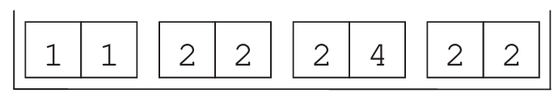

# The Test for the Difference in Means {#ch16}

::: callout-note
### Learning objectives

By the end of this chapter, you should be able to:

-   Formulate null and alternative hypotheses for comparing two independent populations.
-   Calculate the Standard Error of the difference using the law of variances.
-   Conduct a hypothesis test to determine if the difference between two sample means is statistically significant.
-   Understand the choice between the Normal and $t$-distribution in a two-sample context.
:::

## Introduction

So far, we have focused on inference for a single population. However, in economic research and policy analysis, we are often interested in comparing two different and independent populations. For example:\
- Do students in one section perform better than those in another?\
- Is there a wage gap between two different industries?\
- Does a "treatment" group differ significantly from a "control" group?

The core question is whether the observed difference between two sample means is a "real" difference or merely a result of random sampling variation (chance).

## A Motivating Example: Section A vs. Section B

Imagine a statistics course given to two separate groups of students. All students sat the same exam, but the results varied:

* **Section A ($n_1 = 49$):** \
      Average score $\bar{X}_1 = 25$, $SD_1 = 2$.
* **Section B ($n_2 = 36$):** \
      Average score $\bar{X}_2 = 23$, $SD_2 = 3$.

The observed difference is $25 - 23 = 2$ points. Is Section A "smarter," or is this 2-point gap just a result of chance? To answer this, we need a statistical test.

::: {.callout-note}
### Statistical vs. Actual Difference
Of course, 25 is not the same as 23. In a descriptive sense, the sections are different. But in a **statistical** sense, we are asking if this difference is large enough to conclude that the underlying populations (the "smartness" or ability) are truly different.
:::

## Step 1: Formulating Hypotheses

We frame our question using the difference in population means ($\mu_1 - \mu_2$). 

$$
\begin{aligned}
H_0 &: \mu_1 - \mu_2 = 0 \\
H_a &: \mu_1 - \mu_2 > 0
\end{aligned}
$$

In this case, we are using a **one-sided test**, testing specifically if Section A outperforms Section B.^[Alternatively, we could have stated the null as $\mu_1 =
\mu_2$, which technically is the same, but this would be an **equality of means** test, which is a two-sided test, rather than a **difference in means** test.]

## Step 2: The Test Statistic

The test statistic follows the same logic as the one-sample case: how many standard errors is our "observed" value from our "expected" value?

$$TS = \frac{\text{observed difference} - \text{expected difference}}{\text{SE of the difference}}$$

### The Law of Variances
To find the Standard Error for two independent samples, we cannot simply add the SEs. Instead, we use the **law of variances**, which states that for independent variables $A$ and $B$, $Var(A + B) = Var(A) + Var(B)$.

To get the SE of the difference, we square the individual SEs (to get variances), add them, and then take the square root:

$$\text{SE of difference} = \sqrt{SE_1^2 + SE_2^2}$$

::: {.callout-important title="Standard Error Calculation"}
For our example:\
1. $SE_1 = \displaystyle\frac{SD_1}{\sqrt{n_1}} = \frac{2}{\sqrt{49}} \approx 0.286$\
2. $SE_2 = \displaystyle\frac{SD_2}{\sqrt{n_2}} = \frac{3}{\sqrt{36}} = 0.5$\
3. $SE_{\text{diff}} = \sqrt{0.286^2 + 0.5^2} \approx 0.58$
:::

### Calculating the TS
Substituting our values into the formula:

$$TS = \frac{(25 - 23) - 0}{0.58} \approx 3.45$$

## Step 3: Conclusion

Does this $TS$ follow a Normal or $t$-distribution? 
The **Degrees of Freedom (df)** for a two-sample test is calculated by summing the losses from both samples:
$$df = (n_1 - 1) + (n_2 - 1)$$

For our example, $df = (49 - 1) + (36 - 1) = 83$. Since this is a large sample, the $t$-distribution will be almost identical to the Normal distribution.

And because TS of 3.45 is pretty large we reject the null hypothesis that the mean of both sections is the same.  

::: {.callout-tip title="Exercise for the Reader"}
Using the test statistic of $3.45$ calculated above, conclude the test using:\
1. The **p-value method** (find the area to the right of 3.45).\
2. The **critical value method** (compare 3.45 to $z = 1.645$ for $\alpha = 0.05$).\
3. The **confidence interval method**.
:::

## Chapter Summary
* To compare two means, we test the null hypothesis that the difference is zero ($H_0: \mu_1 - \mu_2 = 0$).
* The **SE of the difference** is calculated as the square root of the sum of the squared individual SEs.
* If the sample sizes are small, use the $t$-distribution with $df = n_1 + n_2 - 2$.
* A large test statistic suggests that the observed difference is very unlikely to have occurred by chance.

---

## Exercises: Comparing Two Populations

### 1. Study Habits and Confidence Intervals {.unnumbered}
A university survey sampled 132 male students and 279 female students. It found that **53%** of the men and **48%** of the women study more than 8 hours per week. 

(a) Construct a 95% confidence interval for the proportion of male students and female students separately.
(b) By looking at these two individual intervals, can you definitively conclude there is a difference between the two populations? 
(c) If the intervals overlap, does that always mean there is no difference? Suggest a more formal method to test for a difference in proportions.

### 2. Public Policy: Smoking in Bars vs. Restaurants {.unnumbered}
Regular customers at a restaurant ($n_1=112$) and a pub ($n_2=72$) were asked if they approved of a non-smoking policy.

| | Restaurant | Pub |
|:---|:---:|:---:|
| **Approve** | 64 | 36 |
| **Total Sample** | 112 | 72 |

(a) Calculate the sample proportions ($\hat{p}_1$ and $\hat{p}_2$) for both groups.
(b) Conduct a complete hypothesis test to determine if the opinion of restaurant customers differs significantly from that of pub customers.

### 3. Education and Income {.unnumbered}
To study the "return on education," a researcher takes two random samples:

* **High-School Certificate:** $n=250$, $\bar{X} = 28,000$ Baht, $SD = 16,000$ Baht.
* **University Degree:** $n=200$, $\bar{X} = 36,400$ Baht, $SD = 19,000$ Baht.

Is the difference in average income "real," or can it be attributed to sampling chance? Calculate the test statistic and conclude at the 5% level.

### 4. E-Learning Effectiveness (Small Samples) {.unnumbered}
Promoters of a typing tutor software want to test if their online course increases speed. Two groups were tested:

* **Group 1 (Traditional):** 23, 35, 37, 12, 26, 60, 13, 24, 27, 53
* **Group 2 (Online Course):** 56, 30, 55, 48, 35, 40, 33, 23

(a) Conduct a one-sided $t$-test with $\alpha = 0.10$ to see if the online course results in faster typing speeds.
(b) Calculate separate 90% confidence intervals for each group. Does the comparison of these intervals lead to the same conclusion as your $t$-test?

### 5. The SAT Coaching Experiment {.unnumbered}
An experiment was conducted with 200 students. 100 were randomly assigned to a coaching program (Treatment), and 100 received no coaching (Control).

* **Coaching Group:** $\bar{X} = 486$, $SD = 98$.
* **Control Group:** $\bar{X} = 477$, $SD = 103$.

Did the coaching work? Perform a statistical test and explain whether the results are "economically significant" versus "statistically significant."

### 6. Spot the Error: Differences in Percentages {.unnumbered}
An investigator comparing the study habits from Question 1 ($53\%$ vs $48\%$) calculates the test statistic as $z = (53 - 48) / 0.053$. 

* Explain why this calculation is potentially misleading regarding the units (percentages vs. decimals) and the standard error of the difference.

### 7. The Dependent Draw Problem (Advanced) {.unnumbered}
Consider the "box model" illustrated below, where each ticket drawn represents a single observation containing two variables: a left-hand number and a right-hand number.

{fig-align="center" width="60%"}

One hundred draws are made at random with replacement. One student computes the average of the left-hand numbers, and another computes the average of the right-hand numbers.

(a) Calculate the average and Standard Error (SE) for the first student (left-hand numbers)
(b) Calculate the average and SE for the second student (right-hand numbers).
(c) Can you use the standard "Difference in Means" test (where $SE_{diff} = \sqrt{SE_1^2 + SE_2^2}$) to test if there is a difference between these two averages?
(d) Why does the independence of the two samples matter? Since these numbers come from the same tickets, how does that affect your ability to conclude a difference exists?
