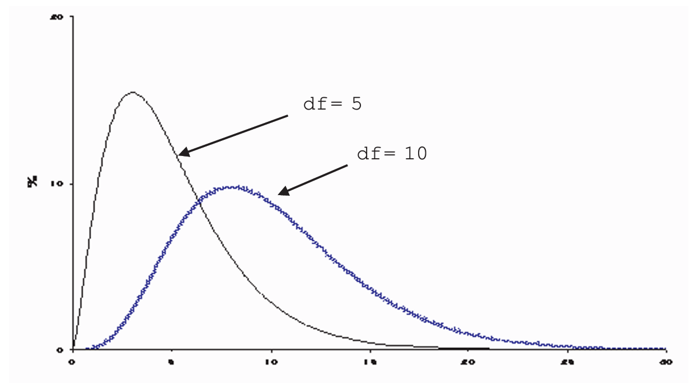

# The Chi-square Test {#ch17}

::: callout-note
### Learning objectives
By the end of this chapter, you should be able to:

-   Distinguish between the **Goodness-of-Fit** test and the **Test for Independence**.
-   Calculate the $\chi^2$ test statistic using observed and expected frequencies.
-   Determine the appropriate degrees of freedom for different table structures.
-   Use the $\chi^2$ table to make statistical inferences about categorical data.
:::

The $\chi^2$-test (pronounced "kai-square") is due to the prominent statistician Karl Pearson. While $z$-tests and $t$-tests are appropriate for numerical data or binary (0-1) outcomes, the $\chi^2$-test is designed for situations involving three or more **categories**. 

In this chapter, we examine two primary applications:

1.  **The Goodness-of-Fit Test:** Does the data fit a specific predetermined model?\
2.  **The Test for Independence:** Are two categorical variables related or independent?

---

## Goodness-of-Fit Test

This test asks whether observed data "fits" a theoretical expectation. For example, consider testing whether a die is fair. If we toss a die 60 times, a fair die should result in each face appearing approximately 10 times.

### Example: Testing a Die
Suppose we observe the following frequencies after 60 throws:

| Outcome | Observed Frequency ($O$) | Expected Frequency ($E$) |
|:---:|:---:|:---:|
| 1 | 4 | 10 |
| 2 | 6 | 10 |
| 3 | 17 | 10 |
| 4 | 16 | 10 |
| 5 | 8 | 10 |
| 6 | 9 | 10 |
| **Sum** | **60** | **60** |

Clearly, the observed and expected frequencies differ—for example, there are fewer 1s and more 3s than expected. The $\chi^2$-test allows us to determine if these deviations are due to chance or because the die is biased.

### The $\chi^2$ Distribution
Unlike the symmetric $z$ or $t$ distributions, the $\chi^2$ distribution is **skewed to the right**, particularly for small degrees of freedom. As the degrees of freedom ($df$) increase, it begins to look more like a normal distribution.

{#chi-square width="70%"}

The $\chi^2$-table [LINK](figs\ch17\chisquared.pdf){target="_blank"} is read like the student's t-table. The first column represents the degrees of freedom, while the top row corresponds to the area under the curve to the right of the $\chi^2$-values shown below. For example, at $df=5$ and .05 significance level, the $\chi^2$-critical value is 14.2.

### Hypothesis Testing for Goofness-of-fit Test
1. **Hypotheses:**
   * $H_0$: The die is fair (Observed fits Expected).
   * $H_a$: The die is biased (Bad fit).

2. **Test Statistic ($TS$):**
   $$\chi^2 = \sum \frac{(\text{observed} - \text{expected})^2}{\text{expected}}$$

3. **Decision Rule:**\
  As before, reject the null if the test statistic is larger than the critical value.\
   For our die example, the calculated $\chi^2 = 14.2$. The degrees of freedom is $6 - 1 = 5$.^[Can you tell why $df=5$?] 
   * At $\alpha = 0.05$ and $df = 5$, the critical value is **11.07**.
   * Since $14.2 > 11.07$, we **reject the null hypothesis**. The die is likely biased.

Likewise, we can get the p-value from the $\chi^2$-table. For $df = 5$, the table shows that the corresponding area to the right of 14.2 is between 5$\%$ (that is the area to the right of 11.07) and 1$\%$ (the area to the right of 15.09). In other words, the p-value is between 5 and 1$\%$, which is less than our depicted $\alpha$. Hence we reject the null.
  
::: {.callout-note}
### Rule of Thumb
The $\chi^2$-test is most reliable when the expected frequency ($E$) for each category is **5 or more**.
:::

---

## Test for Independence

The $\chi^2$ test for independence evaluates whether two categorical variables (e.g., Gender and Handedness) are related in the population.^[Recall that we already looked at the idea of independence in probability, i.e. A and B are said to be independent if $P(A|B)=P(A)$ or $P(B|A)=P(B)$.]

### Example: Handedness and Gender
A survey of 2,237 people yielded the following data:

| | Male | Female | Total |
|:---|:---:|:---:|:---:|
| Right-handed | 934 | 1070 | 2004 |
| Left-handed | 113 | 92 | 205 |
| Ambidextrous | 20 | 8 | 28 |
| **Total** | **1067** | **1170** | **2237** |

The research question is: Are gender and handedness independent? There can be various reasons why a researcher might be interested in such a question. For example, in neurophysiology, it could be hypothesized that women use relatively more their brain's left-side (i.e. their rational faculty) than men do. This could explain why women are more rational then men. Sociologist on the other hand argue that women are under greater pressure to abide to the social norm than men. The alternative is that handedness is distributed the same for men and women in the population, and any difference in the sample data is due to mere chance. Be as it may, the $\chi^2$-test can bring some light to such a question.

**Hypotheses:**\
    $H_0$: Handedness and gender are independent.\
    $H_a$: Handedness and gender are not independent.

### Calculating Expected Frequencies
If the variables are independent, the distribution of handedness should be the same for both genders. \
1.  Calculate the overall ratio for a category (e.g., Right-handed: $2004 / 2237 \approx 89.6\%$).\
2.  Apply this ratio to the gender totals (e.g., Expected Right-handed Males: $0.896 \times 1067 = 956$).

and so on.

|                | observed Male | Observed Female | Ratio (%) | Expected Male | Expected Female |
|----------------|------|--------|-----------|------|--------|
| Right-handed   | 934  | 1070   | 89.6      | 956  | 1048   |
| Left-handed    | 113  | 92     | 9.1       | 98   | 107    |
| Ambidextrous   | 20   | 8      | 1.3       | 13   | 15     |
| Sum            | 1067 | 1170   | 100       | 1067 | 1170   |

### Comparing Observed and Expected
Applying the $\chi^2$ formula to all cells:

$$
\begin{aligned}
\chi^2 &= \frac{(934-956)^2}{956} + \frac{(1070-1048)^2}{1048} + \dots \\
&\approx 12
\end{aligned}
$$

**Degrees of Freedom:**
For a table with $r$ rows and $c$ columns:
$$df = (r - 1) \times (c - 1)$$
In this case: $(3 - 1) \times (2 - 1) = 2$.

The following table shows the difference between the observed and expected values, i.e. the deviations.

|                | Male | Female | Sum |
|----------------|------|--------|-----|
| Right-handed   | -22  | 22     | 0   |
| Left-handed    | -15  | 15     | 0   |
| Ambidextrous   | 7    | -7     | 0   |
| Sum            | 0    | 0      | 0   |

The bottom row and left-most column show that the vertical and horizontal sums respectively, or what is the sum of deviation, add to zero. 
This means that we need to know only 2 deviations (of the six), and the others can be automatically found, hence the degrees of freedom is 2.
In sum, when testing independence in a $m\times n$ table with no other constraints on their probabilities, there are $(m-1) \times (n-1)$ degrees of freedom.

::: {.callout-tip}
### Degree of Freedom Logic
The $df=2$ reflects the fact that in the deviation table (Observed - Expected), once you know two values in a column, the third is "fixed" because the total deviations must sum to zero.
:::

### Conclusion
At $df=2$ and $\alpha=0.05$, the critical value is **5.99**. Since our test statistic $12 > 5.99$, we reject the null hypothesis. There is a statistically significant relationship between gender and handedness.

The p-value is the area to the right of $\chi^2 = 12$ at 2 degrees of freedom. From the table, the p-value is less than $1\%$, which is less than the significance level of $5\%$, hence we reject the null.

## Chapter Summary
* **Goodness-of-Fit** compares one sample to a theoretical distribution.
* **Independence** compares two categorical variables to each other.
* A **large $\chi^2$ value** indicates a large discrepancy between what we see and what we expect, typically leading to a rejection of the null hypothesis.

---

# Exercises: Chi-Square Tests

### 1. Advertising and Market Share {.unnumbered}
Companies A and B dominated the market with shares of **45%** and **40%** respectively (the remaining 15% belonged to other competitors). After an aggressive advertising campaign, a survey of 200 customers revealed the following preferences:

* **Company A:** 102 customers
* **Company B:** 82 customers
* **Others:** 16 customers

**Task:** Using a Goodness-of-Fit test at the 5% significance level, determine if customer preferences have shifted significantly away from the initial market shares.

### 2. Marital Status and Gender {.unnumbered}
A sociological study sampled 103 persons (48 men and 55 women) to examine marital status. The data is presented as percentages within each gender:

| Status | Men (%) | Women (%) |
|:---|:---:|:---:|
| Never Married | 43.8% | 16.4% |
| Married | 41.7% | 70.9% |
| Divorced / Widowed | 14.5% | 12.7% |

(a) Convert these percentages back into raw counts (frequencies) for a contingency table.
(b) Perform a test for independence. Are the marital status distributions statistically different for men and women?

### 3. The "Two-Way" Die Test {.unnumbered}
To test if a die is fair, a researcher rolls it 600 times. Instead of recording faces 1 through 6, they categorize each roll in two ways: **Size** (Large: 4,5,6 vs. Small: 1,2,3) and **Parity** (Even vs. Odd).

| | Large (4,5,6) | Small (1,2,3) |
|:---|:---:|:---:|
| **Even** | 183 | 113 |
| **Odd** | 88 | 216 |

(a) If the die were fair, what would be the expected frequency for each of the four cells?
(b) Based on the $\chi^2$ test, is the die fair?
(c) Looking at the table, does the die seem biased toward specific numbers?

### 4. Academic Intentions {.unnumbered}
300 prospective students were surveyed regarding their intended field of study. The administration wants to know if there is a gender bias in faculty choice.

| | Engineering | Science | Art |
|:---|:---:|:---:|:---:|
| **Male** | 37 | 41 | 44 |
| **Female** | 35 | 72 | 71 |

(a) State the null hypothesis ($H_0$) and the alternative hypothesis ($H_a$).
(b) Calculate the $\chi^2$ test statistic.
(c) Test the hypothesis of "no association" at the **10%** significance level.
(d) Would your conclusion change if you used a more stringent **5%** significance level? Explain the trade-off.
