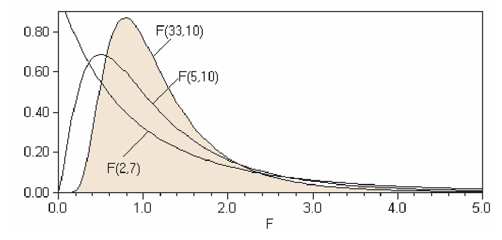

# The F-distribution and ANOVA {#ch18}

::: callout-note
### Learning objectives
By the end of this chapter, you should be able to:

-   Describe the characteristics of the $F$-distribution and its parameters.
-   Test for the equality of variances between two independent populations.
-   Perform a One-Way Analysis of Variance (ANOVA) to compare means across multiple groups.
-   Interpret the ANOVA table to distinguish between "Between-group" and "Within-group" variation.
:::

The $F$-distribution and Analysis of Variance (ANOVA) are primary examples of the statistical brilliance of R.A. Fisher. In this chapter, we will learn how to test for differences in variability and how to compare multiple means simultaneously—both of which rely on the $F$-distribution.

## Test for Equality of Variances

Like the Normal, $t$, and $\chi^2$ distributions, the $F$-distribution represents a "family" of curves. Each member is determined by two separate parameters:  
1. The **numerator** degrees of freedom ($v_1$).\
2. The **denominator** degrees of freedom ($v_2$).

::: {.callout-note}
### Distribution Relationships
Interestingly, the distributions we have studied are mathematically linked. For example:\
-   The $t$-distribution is related to $F(1, v_2)$.\
-   The $\chi^2$-distribution is related to $F(v_1, \infty)$.
:::

{#f-distribution width="70%"}

Here is the [LINK](figs\ch18\f.pdf){target="_blank"} for the F-table.

### Characteristics of the $F$-distribution
* **Non-negative:** Values range from $0$ to $\infty$.
* **Asymmetric:** It is positively skewed, especially at lower degrees of freedom.
* **Continuous:** It represents the ratio of two independent chi-square variables.

### Example: Internet vs. Utility Stocks
A stockbroker wants to know if Internet stocks are more volatile/risky (have higher variance) than Utility stocks. Looking at the data, he finds that mean rate of return on a sample of 13 Internet stocks was 12.6 percent with a standard deviation of 4.9 percent, while, the mean rate of return on a sample of 25 utility stocks was 10.9 percent with a standard deviation of 3.1 percent.

* **Internet Stocks ($I$):** $n_I = 13$, $SD_I = 4.9\%$.
* **Utility Stocks ($U$):** $n_U = 25$, $SD_U = 3.1\%$.

Formally, we wish to test for equal **variances** of the two populations, Internet versus utility stocks.\

1. **Hypotheses:**
   * $H_0: \sigma^2_I = \sigma^2_U$\
   * $H_a: \sigma^2_I > \sigma^2_U$.

2.  **The Test Statistic:**
$$F = \frac{\sigma^2_{\text{larger}}}{\sigma^2_{\text{smaller}}} = \frac{SD^2_I}{SD^2_U} = \frac{(4.9)^2}{(3.1)^2} \approx 2.50$$

3.  **Conclusion:**

The degree of freedom for the numerator and the denominator are $n_I -1$ and $n_U - 1$ respectively. and after deciding on the significant level, we read the “critical value” from the corresponding F-table, which is the number where the $v_1$ and $v_2$ column and row intersect.

Here is a copy of the F-table [LINK].

In our example, $v_1 = 12$ and $v_2 = 24$, and the critical value at $\alpha = 0.05$ is **2.18**.

Since $2.50 > 2.18$, we reject the null hypothesis. The Internet stocks exhibit significantly higher variance.

---

## Analysis of Variance (ANOVA)

While the $t$-test compares the means of **two** populations, **ANOVA** tests the equality of means for **three or more** populations using a single $F$-statistic. The "beauty" of ANOVA is that it compares variances to draw conclusions about means.

### Example: Restaurant Sales
Consider daily dinner sales at three different restaurant locations:

| Day | R1 | R2 | R3 |
|:---:|:---:|:---:|:---:|
| 1 | 13 | 10 | 18 |
| 2 | 12 | 12 | 16 |
| 3 | 14 | 13 | 17 |
| 4 | 12 | 11 | 17 |
| 5 | — | — | 17 |
| **Mean** | **12.75** | **11.5** | **17.0** |

We observe 13 data points, $n = 13$, and 3 restaurants (or 3 treatment groups) denoted $k = 3$.
The starting point is to specify the null and alternative hypothesis. \

The average of all data points or `Grand Mean` ($\overline{X}_G$) is 14. Hence, the total variation, $\sum_n (X_n - \overline{X}_G)$ is 86. The averages of the restaurants are 12.75, 11.5 and 17 for R1, R2 and R3, respectively. 

**Hypotheses:**\
     $H_0: \mu_{R1} = \mu_{R2} = \mu_{R3}$\
     $H_a$: At least one mean is different.

### The Logic of ANOVA
ANOVA splits total variation into two components:\
1. **Between-Group Variation:** Variation across the averages of the restaurants. This represents potential "treatment effects" (location quality).\
2. **Within-Group Variation:** Variation within each restaurant's daily sales. This represents "chance error" or random noise.

We then compare these using the $F$-ratio:
$$F = \frac{\text{Mean Square `Between` (MSB) Variation}}{\text{Mean Square `Within` (MSW) Variation}}$$

The idea is to split the total variation in the data or **total sum of squares** into a `between groups` variation and `within groups` variation. 

That is, we calculate the average for each group and then its variation for each restaurant; this is `within group` variation. Most probably not every data in each group is equal to its group average; there is bound to be some variation, which because there is no reason to think otherwise, we may assume that this variation is in fact due to chance. So the `within variation` represents **chance variation**. 

Likewise, the average of different groups (restaurants) should be different, and this may be due to fundamental differences between the groups. Such variation is appropriately called `between group` variation representing variation because of some factor or treatment.

The F-test compares the variation possibly due to some factor or treatment against the chance (within) variation. If these variations are statistically different, then we conclude that the treatment is meaningful, i.e. that there is indeed a difference in the means of at least any two populations. It is best to summarize this in the ANOVA table below.

### The ANOVA Table

| Source of Variation | Sum of Squares (SS) | $df$ | Mean Square (MS) | $F$ |
|:---|:---:|:---:|:---:|:---:|
| **Between** (Treatment) | 76.25 | $3-1 = 2$ | 38.125 | **39.103** |
| **Within** (Error) | 9.75 | $13-3 = 10$ | 0.975 | |
| **Total** | **86.00** | **12** | | |

The `between groups` variation is $\sum_k n_k (\overline{X}_k - \overline{X}_G)^2$, which gives us 76.25. Because `total variation = between variation + within variation`, we can easily find `within variation` as $86-76.25 = 9.75$.

For total variation, which is nothing more than the total sum of all deviations of each data point from the overall grand mean, we lose one degree of freedom, that is, $n-1 = 12$. The between groups variation treats all numbers in each group equivalently. Hence the deviation of $k$ groups with respect to the overall mean has $k-1 = 2$ degrees of freedom. For each group, the within variation leads to a loss of one degree of freedom in each group. With $k$ groups, the total within group variation will result in $n-k = 10$ degrees of freedom.

Dividing the sum of squares by the degrees of freedom gives the **mean sum of squares** or variance. And the F-test statistic intuitively compares the average variation across the groups with the chance variation represented by the within group variation.

### Conclusion
At $\alpha = 0.05$ with $v_1=2$ and $v_2=10$, the critical value is **4.10**. 
Since our $F$-statistic ($39.1$) is far greater than 4.10, we **reject the null hypothesis**. There is a statistically significant difference in the mean sales across the three locations.

::: {.callout-tip}
### Visualizing ANOVA
If you were to plot the confidence intervals for these three restaurants, you would likely see that the interval for R3 does not overlap with R1 or R2. This lack of overlap is a visual confirmation of the ANOVA result.
:::

## Chapter Summary
* The **$F$-test for variances** checks if two populations have the same spread.
* **ANOVA** decomposes total variation to check if group means are equal.
* The $F$-statistic is a ratio: if the "Between" variation is much larger than the "Within" variation, we conclude the group identities matter.

Here are the exercises rewritten in the **Econ-Core** style. I have organized them to emphasize real-world data interpretation and the logical flow of statistical testing.

---

## Exercises: Variance and ANOVA

### 1. Comparing Volatility {.unnumbered}
You have two independent populations, A and B. You take 20 draws from Population A, resulting in a standard deviation ($SD$) of 13. You take 15 draws from Population B, resulting in an $SD$ of 15.\

(a) State the null and alternative hypotheses for a two-sided test regarding the variances.  
(b) Calculate the $F$-test statistic.  
(c) Using the $F$-table, can you conclude at the 5% significance level that the variances of the two populations are different? Explain your reasoning briefly.

### 2. Water Expenditure in Urban Areas {.unnumbered}
The following table shows the annual expenditure (in millions of Baht) on water for randomly selected households in three different areas.

| Area A | Area B | Area C |
|:---:|:---:|:---:|
| 780 | 650 | 640 |
| 690 | 689 | 689 |
| 735 | 700 | 673 |
| 750 | 655 | 702 |
| 766 | 680 | 681 |
| 689 | | |

(a) Conduct a One-way ANOVA to test the claim that mean water expenditure is identical across the three areas.
(b) Before performing the ANOVA, we assume "homoscedasticity" (equal variances). Perform a quick check: are the variations in expenditure across these areas statistically similar enough to justify an ANOVA?

### 3. The "Missing Link" ANOVA Table {.unnumbered}
A researcher provides you with a partially completed ANOVA table from a study on regional productivity.

| Source of Variation | $df$ | Sum of Squares (SS) | Mean Square (MS) | $F$ |
|:---|:---:|:---:|:---:|:---:|
| Between Groups | 6 | 17.5 | — | — |
| Within Groups | — | — | — | |
| **Total** | **41** | **46.5** | | |

(a) Complete the missing values in the table.
(b) Based on the degrees of freedom, how many groups were being studied? State the null and alternative hypotheses.
(c) Using a 10% level of significance ($\alpha = 0.10$), what is your statistical conclusion?
(d) Estimate the p-value range for this test.

### 4. Stock Market Analysis (Incomplete Data) {.unnumbered}
An analyst is comparing the average rate of return for three stock sectors: **Utility**, **Retail**, and **Banking**. Due to a printer error, several values in the output are missing.

**Table 1: ANOVA Output**

| Source | $df$ | Sum of Squares | Mean Square | $F$ |
|:---|:---:|:---:|:---:|:---:|
| Between | **(a)** | 86.49 | **(b)** | **(c)** |
| Within | 13 | 42.93 | 3.30 | |
| **Total** | **(d)** | **(e)** | | |

**Table 2: Sector Summary**

| Stock Type | $n$ | Mean | $SD$ |
|:---|:---:|:---:|:---:|
| Utility | 5 | 17.40 | 1.916 |
| Retail | **(f)** | 11.62 | 0.356 |
| Banking | 6 | 15.40 | **(g)** |

(a) Identify which of the missing figures (a through g) **cannot** be calculated using only the visible data. 
(b) Using $\alpha = 0.05$, is there a significant difference in the mean rate of return among the three types of stock?
(c) If the null hypothesis is rejected, does this automatically prove that Utility stocks perform differently than Retail stocks? Explain the concept of "Post-hoc" testing or pairwise comparisons briefly.
