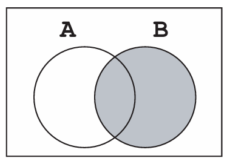
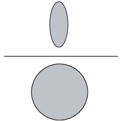
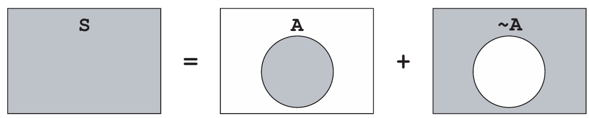
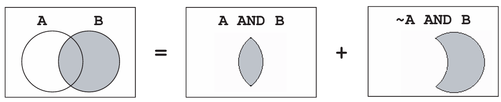
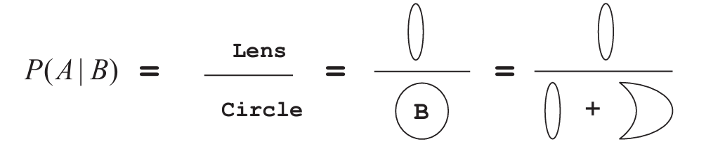

# Elementary Probability {#ch7}

::: callout-note
### Learning objectives

By the end of this chapter, you should be able to:

-   explain the main interpretations of probability,
-   define experiments, outcomes, sample spaces, and events,
-   compute conditional probabilities,
-   apply the multiplication and addition rules,
-   distinguish between independence and dependence,
-   understand concept of mutually exclusive,
-   use Bayes’ rule to update probabilities,
-   understand the axioms underlying probability theory.
:::

In this chapter, we introduce the basic ideas of **probability** needed to understand statistical concepts and reasoning. The literature typically identifies **three definitions of probability**:

1.  the **classical** definition,\
2.  the **empirical (frequentist)** definition, and\
3.  the **subjective** definition.

The **classical definition** assumes that all outcomes of an experiment are equally likely. For example, when rolling a fair die, the probability of obtaining an even number is the ratio of favorable outcomes (2, 4, 6) to total possible outcomes (1–6), which is $3/6 = 1/2$.

The **empirical (frequentist) definition** is based on observed relative frequencies. For example, one might talk about the probability that Manchester United beats Chelsea, based on the fraction of past games won by Manchester United.

The **subjective definition** reflects an individual’s beliefs, informed by experience and available information. For instance, a student may assign a subjective probability to the event that they will earn an A in a statistics course like this one.

::: callout-note
### A unifying point

Although these interpretations differ philosophically, the **mathematics of probability** that follows does not depend on which definition we adopt.
:::

## The probability space, experiment, and outcome

Consider tossing a coin. The outcome is uncertain: it may land **heads** or **tails**. In probability language, tossing the coin is an **experiment**, and the result is an **outcome**.

An experiment produces exactly **one outcome**, chosen from a set of possible outcomes. This set is called the **sample space**, denoted $\mathcal{S}$. A **subset** of the sample space is called an **event**.

There is no restriction on what constitutes an experiment. Tossing one coin once, tossing it three times, or even tossing it infinitely many times can each be considered a single experiment.

To make this concrete, consider tossing a coin **three times**. The sample space is

$\mathcal{S} = \{HHH, HHT, HTH, HTT, THH, THT, TTH, TTT\}$.

If we assume each outcome is equally likely, then each has probability $1/8$.

::: callout-important
### A basic fact

Probabilities always lie between 0 and 1 (or 0% and 100%).
:::

From this, it follows that for any event $A$,

$P(\sim A) = 1 - P(A)$,

where $\sim A$ denotes the complement of $A$ or (not A).

## Conditional probability

Conditional probability is best understood through an example.

Suppose a deck of cards is shuffled and two cards are drawn. You win 100 baht if the **second card** is the ACE of hearts. Before seeing any cards, the probability of winning is $1/52$.

Now imagine that the **first card is revealed** and it is the seven of clubs. What is your probability of winning now?

Since one card is no longer in the deck (and you know what it is), the probability becomes $1/51$.

Put differentlay, when pulling out two cards, because you now know the first card, the probability of the second card is a conditional probability i.e. the probability of a particular event occurring, given that another event has occurred. This is compactly written as $P(A \mid B)$.

::: callout-important
### Conditional probability

Conditional probability reflects how probabilities change **once new information becomes available**.
:::

Formally, the probability that event $A$ occurs **given** that event $B$ has occurred is written $$P(A \mid B)$$ and read as the probability of $A$ given $B$.

## The multiplication rule

Consider a box containing three tickets labeled R, W, and B. Two tickets are drawn **without replacement**. What is the probability of drawing R first and then W?

On the first draw, the probability of R is $1/3$. Given that R was drawn, only W and B remain, so the probability of W on the second draw is $1/2$. Therefore,

$P(R \text{ then } W) = \displaystyle \frac{1}{2} \text{ of } \frac{1}{3} = \frac{1}{6}$.

This illustrates the **multiplication rule**:

$P(AB) = P(B \mid A)P(A) = P(A \mid B)P(B)$.

For example, the probability that **two cards dealt from a deck are both ACES** is

$\displaystyle \frac{3}{51} \times \frac{4}{54}$.

## Independence

Two events are said to be **independent** if knowing the outcome of one does not affect the probability of the other.

Drawing with replacement produces independent events; drawing without replacement produces dependent events.

::: callout-important
### Independence

Events A and B as said to be **independent** if 

$$P(A \mid B) = P(A)$$

(or equivalently $P(B \mid A) = P(B)$).
:::

When we have independence, the multiplication rule conveniently simplifies to

$P(AB) = P(A)P(B)$.

## Checking for independence

Suppose we want to know whether graduating from GA program helps someone become a successful manager/CEO.

Let: 

- $A_i$: GA graduate `(=1)`, or 0 otherwise  
- $B_i$: Becomes CEO `(=1)`, or 0 otherwise

The table below summarizes survey results:

|                 | Becomes CEO | Does not become CEO | **Total** |
|-----------------|-------------|---------------------|-------|
| GA graduate     | 0.11        | 0.29                | 0.40  |
| Not GA graduate | 0.06        | 0.54                | 0.60  |
| **Total**       | 0.17        | 0.83                | 1.00  |

The **marginal probability** of becoming a CEO is 0.17. The **joint probability** of a GA graduate becoming a CEO is 0.11, and so on.

To test independence, compute

$P(A_1 \mid B_1) = \displaystyle \frac{P(A_1 B_1)}{P(B_1)} = \displaystyle \frac{0.11}{0.17} \approx 0.65$.

Since $P(A_1 \mid B_1) \neq P(A_1)$, the two events are **not independent**.

::: callout-tip
### Interpretation

Becoming a CEO is related to being a GA graduate in this example.
:::

## The addition rule

Two events are said to be **mutually exclusive** if the occurrence of one prevents the occurrence of the other.

For mutually exclusive events,

$P(A \text{ or } B) = P(A) + P(B)$.

For example, intuitively, if we draw one card from a deck of cards, the probability of getting either a heart or spades is $\frac{1}{4} + \frac{1}{4} = \frac{1}{2}$. The additional rule tells us to simply add the chances provided that the two events are mutually exclusive. The probability to get a heart is 1/4 and the probability to get a spade is also 1/4. Are the two events mutually exclusive? Yes, getting a heart means you can't get a spade, and vice versa. So simply add the chances to get $1/4 + 1/4 = 1/2.$

However, for events that are **not mutually exclusive**, the general addition rule is

$P(A \text{ or } B) = P(A) + P(B) - P(A \text{ and } B)$.

For example, if we toss two dice at the same time, to get at least ace on the two dice, we calculate the probability using the general additional rule, i.e we add the chances and subtract the joint probability because the two events are not mutually exclusive since having an ace on one of the die does not exclude the possibility to get an ace on the other die. In other words, it is possible to get ACE in both dice, i.e. the events are **not** mutually exclusive! Hence we get $1/6 + 1/6 - 1/36 = 11/36.$

::: callout-important
### Mutually exclusive events

Events A and B as said to be **mutually exclusive** if 

$$
P(A \text{ and } B) = 0
$$
:::

Note that we have used the word 'or' and 'at least' for the additional rule, which can be contrasted with 'and' for the multiplication rule. In terms of set operations, these are the union and intersect operators, respectively.

## Venn diagrams

Venn diagrams are very useful when thinking about simple probability problems.\
For example, two events A and B that are not disjoint can be drawn as follows:

{fig-align="center" width="40%"}

Even more useful, the conditional probability can be shown by the following:

$P(A|B) =$

 or $\frac{P(AB)}{P(B)}.$ That is, given B we wish to know A.

## Bayes’ rule

We can easily derive the Bayes' Rule using Venn diagrams.

Taking a sample space with event A:

Similarly, the probability of B can be shown using the Venn diagram as follows: \\

Combining the two Venn diagrams we get:\\

Or what is the same thing

\begin{equation}
P(A|B) = \frac {P(A \text{ and } B)}{P(B)} = \frac {P(A \text{ and } B)}{P(A \text{ and } B) + P(\sim A \text{ and } B)} \notag \\
\end{equation}

And finally from the definition of joint probabilities we have the Bayes Rule.

::: callout-important
### Bayes' Rule

$$
P(A \mid B) = \frac{P(A)P(B \mid A)}{P(A)P(B \mid A) + P(\sim A)P(B \mid \sim A)}
$$
:::

So how do we use the Bayes' Rule? An example should illustrate this. Assume that on a dark night, there was a hit and run accident. A witness, who says that she saw a blue taxi, agrees to sit in the court to testify for the victim so that the latter might get some compensation from the blue taxi company. Incidentally, there are 200 taxis in this town; 170 or 85 % belong to the black taxi company and 30 or 15 % are blue. According to tests conducted under the same condition, the witness identifies blue taxi about 80 % of the time. Now, the question is, What is the probability that she was right, that she really did see a blue taxi that night?

-   15% of taxis are blue\
-   85% are black\
-   The witness correctly identifies blue taxis 80% of the time\
-   She incorrectly identifies black taxis as blue 20% of the time

To use Bayes' formula, all we have to identify are a few marginal and conditional probabilities; P(A) is the probability that the taxi involved in the accident is blue (i.e 15 %.) Hence $P(\sim A)$ that is the probability of a black taxi, is 85 %. $P(B \mid A)$ is the probability that the witness claims to have seen blue when a blue taxi was really involved, in other words, her accuracy in identifying a blue taxi correctly under the conditions. Conversely, the only other probability we need now to complete the equation is $P(B \mid \sim A)$, which is the probability that the witness sees a blue taxi when in fact a black taxi was involved. i.e 20 %. Plugging all the relevant probabilities gives:

$P(A \mid B) = \displaystyle \frac{0.15 \times 0.80}{(0.15 \times 0.80) + (0.85 \times 0.20)} = \frac{0.12}{0.29} \approx 0.41$.

The probability that the witness says she saw 'blue' and that it was really a blue taxi is only 0.41, hardly sufficient for the courts to ask the blue taxi company to pay compensation!

::: callout-warning
### A sobering result

Even confident testimony can be misleading when base rates are ignored.
:::

## Axioms of probability

Probability rests on three axioms:

1.  **Nonnegativity:** $P(A) \ge 0$\
2.  **Additivity:** For disjoint events, $P(A \cup B) = P(A) + P(B)$\
3.  **Normalization:** $P(\mathcal{S}) = 1$

From these axioms follow many useful properties, such as:

-   If $A \subset B$, then $P(A) \le P(B)$\
-   $P(A \cup B) = P(A) + P(B) - P(A \cap B)$\
-   $P(A \cup B) \le P(A) + P(B)$

::: callout-important
### Chapter summary

Probability provides a formal language for reasoning under uncertainty. In this chapter, we introduced experiments, events, conditional probability, independence, and the fundamental rules governing probabilities. These ideas form the foundation for statistical inference in the chapters ahead.
:::
