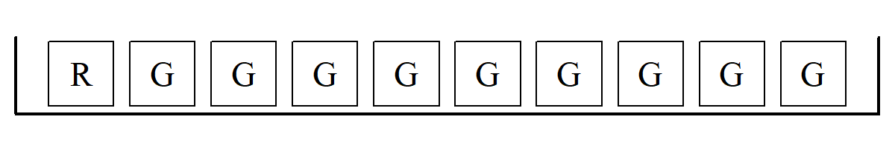

# Binomial and Poisson Distributions {#ch9}

::: callout-note
### Learning objectives

By the end of this chapter, you should be able to:

-   apply basic counting principles (permutations and combinations),
-   derive and use the binomial probability formula,
-   compute probabilities for “exactly $x$ successes” problems,
-   understand when the normal distribution approximates the binomial,
-   define and apply the Poisson distribution,
-   recognize when binomial and Poisson models are appropriate.
-   briefly introduce the geometric and negative binomial distribution.
-   briefly mention the hypergeometric distribution.
:::

------------------------------------------------------------------------

## Counting principles

Before introducing the binomial formula, we need a short detour into **counting**.

Probability often reduces to a simple question:

> How many possible outcomes are there?

### The multiplication rule of counting

If one task can be performed in $m$ ways and a second task in $n$ ways, then the two tasks together can be performed in $m \times n$ ways.

**Example:**\
A restaurant offers 3 starters and 4 main courses.\
The number of possible meals is:

$$
3 \times 4 = 12.
$$

This simple idea lies behind much of probability theory.

------------------------------------------------------------------------

### Permutations

A **permutation** counts the number of ways to arrange objects when order matters.

The number of ways to arrange $n$ distinct objects is:

$$
n! = n(n-1)(n-2)\dots 1.
$$

If we choose $k$ objects out of $n$ and order matters, the number of permutations is:

$$
P(n,k) = \frac{n!}{(n-k)!}.
$$

------------------------------------------------------------------------

### Combinations

A **combination** counts the number of ways to choose objects when order does *not* matter.

The number of combinations of $k$ objects from $n$ is:

$$
\binom{n}{k} = \frac{n!}{k!(n-k)!}.
$$

This expression is called the **binomial coefficient**.

It plays a central role in the binomial distribution.

------------------------------------------------------------------------

## The Binomial Distribution

We often encounter problems of the form:

-   A coin is tossed 4 times. What is the probability of exactly 1 head?
-   A die is rolled 10 times. What is the probability of exactly 3 sixes?
-   A box contains 1 red and 9 green marbles. Five draws are made *with replacement*. What is the probability of exactly 2 red marbles?

These are examples of **binomial experiments**.

### Conditions for a binomial model

A binomial model applies when:

1.  The number of trials $n$ is fixed.
2.  Each trial has two possible outcomes (success/failure).
3.  The probability of success $p$ is constant.
4.  The trials are independent.

------------------------------------------------------------------------

### Box Model Example

Let's look more closely at the last example above. We might start with a box model:

```{r}
#| include: false
# THE FINAL CLEAN CODE FOR BOX MODEL
draw_and_save_box <- function(filename = "figs/ch8/r-g.png") {
  
  # 1. Open file with wide Aspect Ratio
  # 11 units wide (10 boxes + padding) by 1.5 units high
  png(filename, width = 1200, height = 200, res = 150)
  
  # 2. Set margins to absolute zero
  par(mar = c(0, 0, 0, 0))
  
  # 3. Data: 1 Red, 9 Green
  labels <- c("R", rep("G", 9))
  
  # 4. The Plot
  # xlim 0 to 11 provides space for 10 boxes
  plot(0, 0, type = "n", xlim = c(0, 11), ylim = c(0.15, 1.35), 
       axes = FALSE, xaxs = "i", yaxs = "i", asp = 1)
  
  # 5. Draw the 10 boxes (The "Tickets")
  for(i in 1:10) {
    # rect(xleft, ybottom, xright, ytop)
    rect(i - 0.4, 0.35, i + 0.4, 1.15, lwd = 1.5)
    text(i, 0.75, labels = labels[i], cex = 1.8, family = "serif")
  }
  
  # 6. Draw the Tray (U-shape: No top line)
  # x0/y0 to x1/y1 defines the three lines of the box
  segments(x0 = c(0.2, 0.2, 10.8),  # Start of Left wall, Floor, Right wall
           y0 = c(1.2, 0.25, 0.25), # Top of left, bottom-left, bottom-right
           x1 = c(0.2, 10.8, 10.8), # End of Left wall, Floor, Right wall
           y1 = c(0.25, 0.25, 1.2), # bottom-left, bottom-right, Top of right
           lwd = 3)
  
  # 7. Close and save
  dev.off()
}

# --- EXECUTION ---
# Ensure the directory exists before saving
if(!dir.exists("figs/ch8")) dir.create("figs/ch8", recursive = TRUE)
draw_and_save_box("figs/ch8/r-g.png")
```

{#fig-r-g fig-align="center"}

From the above, we draw 5 tickets at random with replacement. But we want exactly 2 R's and 3 G's (e.g., $\fbox{R}, \fbox{R}, \fbox{G}, \fbox{G}, \fbox{G}$ or $\fbox{G}, \fbox{R}, \fbox{G}, \fbox{G}, \fbox{R}$, etc.). The exact probability can be found using 3 simple steps:

**1) Find all the possible ways:** $$
\frac{5!}{2! \times 3!} = \frac{\text{total cases}}{\text{no. of successes} \times \text{no. of failures}}
$$

**2) Calculate the chance of each:** $$
\frac{1}{10} \times \frac{1}{10} \times \frac{9}{10} \times \frac{9}{10} \times \frac{9}{10} = \left( \frac{1}{10}\right)^2 \left( \frac{9}{10}\right)^3
$$

**3) Use the addition rule to add up the chances:** $$
\frac{5!}{2! \times 3!} \times \left( \frac{1}{10}\right)^2 \left( \frac{9}{10}\right)^3 \approx 7\%
$$

This can be interpreted as the chance of getting exactly 2 $\fbox{R}$'s.

Note that **step 1** is actually the *binomial coefficient*, which gives us the total number of combinations of arranging 2 R's and 3 G's. In **step 2**, the chance of getting $\fbox{R}, \fbox{R}, \fbox{G}, \fbox{G}, \fbox{G}$ is the same as getting $\fbox{G}, \fbox{R}, \fbox{G}, \fbox{G}, \fbox{R}$, and so on. Lastly, **step 3** involves the addition rules as all events are mutually exclusive (disjoint).

### The Binomial Formula

::: callout-important
### The Binomial Probability Formula

If $X$ counts the number of successes in $n$ independent trials with success probability $p$, then

$$
P(X = x) = \binom{n}{x} p^x (1-p)^{n-x},
\quad x = 0,1,\dots,n.
$$
:::

Where:

-   $n$ = number of trials\
-   $x$ = number of successes\
-   $p$ = probability of success

In short, we can write $X \sim \text{Bin}(n, p)$.

------------------------------------------------------------------------

### Example

A neighbor has 3 children. What is the probability exactly 2 are boys?

Assuming $p = 1/2$,

$$
P(X=2) = \binom{3}{2}
\left(\frac{1}{2}\right)^2
\left(\frac{1}{2}\right)^1
= \frac{3}{8}.
$$

This is exactly the same as the probability of 2 heads in 3 coin tosses.

Note that you can get all $P(X=0), P(X=1), P(X=2), and P(X=3),$ using the binomial formula, i.e.e the entire distribution corresponding to the probability of no boys, one boy, ... , all three boys for my neighbor with 3 children!

------------------------------------------------------------------------

### Mean and variance of the binomial

If $X \sim \text{Bin}(n,p)$, then

$$
E(X) = np
$$

$$
\text{Var}(X) = np(1-p)
$$

These formulas are extremely useful.

::: {.callout-note collapse="true"}
### Derivation of the Mean and Variance of a Binomial Distribution (**OPTIONAL**)

Let $X \sim \text{Bin}(n, p)$, where the probability mass function is:

$$P(X = x) = \binom{n}{x} p^x (1-p)^{n-x}$$

#### 1. Derivation of the Mean or Expected Value {.unnumbered}

By definition, the expected value is:

$$E(X) = \sum_{x=0}^{n} X \cdot P(X=x) = \sum_{x=0}^{n} X \binom{n}{x} p^x (1-p)^{n-x}$$

Drop the $X=0$ term, since the first term is $0 \cdot P(X=0)$, we can start the sum at $X=1$.

We can simplify the combination by the identity $X \binom{n}{x} = n \binom{n-1}{x-1}$.

$$E(X) = \sum_{x=1}^{n} n \binom{n-1}{x-1} p^x (1-p)^{n-x}$$

Factor out $np$. That is, pull a $n$ and one $p$ outside the summation.

$$E(X) = np \sum_{x=1}^{n} \binom{n-1}{x-1} p^{x-1} (1-p)^{n-x}$$

Let's re-index the sum. Let $k = x-1$. As $x$ goes from $1$ to $n$, $k$ goes from $0$ to $n-1$.

$$E(X) = np \sum_{k=0}^{n-1} \binom{n-1}{k} p^k (1-p)^{(n-1)-k}$$

Apply the Binomial Theorem. The entire summation is just the expansion of $(p + (1-p))^{n-1}$. Since $(p + 1 - p) = 1$, the sum is $1^{n-1} = 1$.

$$E(X) = np \times 1 = np$$

Another way to see this, which is quicker, is to think of a Binomial random variable $X$ as the sum of $n$ independent Bernoulli trials ($X_1, X_2, \dots, X_n$), where each $X_i$ is 1 for a success and 0 for a failure.

$$X = X_1 + X_2 + \dots + X_n$$

Hence, the mean of a single trial is $E(X_i) = (1 \times p) + (0 \times (1-p)) = p$.

And using the linearity of expectation, the expected value of a sum is the sum of the expected values:

$$E(X) = E(X_1) + E(X_2) + \dots + E(X_n)$$

So,

$$
E(X) = p + p + \dots + p = np
$$

------------------------------------------------------------------------

#### 2. Derivation of the Variance {.unnumbered}

To derive the variance of a binomial distribution, we typically use the formula:

$$
\text{Var}(X) = E(X^2) - [E(X)]^2
$$

Since we already know that $E(X) = np$, we only need to find $E(X^2)$.

A common "trick" in discrete math is to rewrite $X^2$ as $X(X-1) + X$. This allows us to use the same combination-reduction trick we used for the mean.

$$\text{Var}(X) = E(X(X-1)) + E(X) - [E(X)]^2$$

First, calculate $E(X(X-1))$:

Using the PMF of the binomial distribution:

$$E[X(X-1)] = \sum_{X=0}^{n} X(X-1) \binom{n}{x} p^x (1-p)^{n-x}$$

Here again the terms for $X=0$ and $X=1$ are zero, so the sum starts at $X=2$.

Let's reduce the combination. Use the identity $X(X-1) \binom{n}{x} = n(n-1) \binom{n-2}{x-2}$.

$$E[X(X-1)] = \sum_{x=2}^{n} n(n-1) \binom{n-2}{x-2} p^x (1-p)^{n-x}$$

And factor out constants, i.e. pull out $n(n-1)$ and $p^2$.

$$E[X(X-1)] = n(n-1)p^2 \sum_{x=2}^{n} \binom{n-2}{x-2} p^{x-2} (1-p)^{n-x}$$

Lastly sum to 1. Just like in the mean derivation, the remaining sum is the binomial expansion of $(p + (1-p))^{n-2}$, which equals $1$.

$$E[X(X-1)] = n(n-1)p^2$$

Now substitute everything back into the variance formula:

$$\text{Var}(X) = E(X(X-1)) + E(X) - [E(X)]^2$$

$$\text{Var}(X) = n(n-1)p^2 + np - (np)^2$$ Expand terms:

$$\text{Var}(X) = n^2p^2 - np^2 + np - n^2p^2$$

The $n^2p^2$ terms cancel out, leaving

$$\text{Var}(X) = np - (np)^2 = np(1-p)$$

The intuitive shortcut, if you prefer, is to use the linearity of expectation approach again. The variance of a single Bernoulli trial ($X_i$) is $p(1-p)$. Since the trials are independent, the variance of the sum is the sum of the variances:

$$\text{Var}(X_1 + \dots + X_n) = \text{Var}(X_1) + \dots + \text{Var}(X_n)$$

So,

$$\text{Var}(X) = p(1-p) + \dots + p(1-p) = np(1-p)$$
:::

------------------------------------------------------------------------

## Normal approximation to the binomial distribution

When $n$ is large, calculating binomial probabilities directly can be tedious.

Fortunately, the **Central Limit Theorem** tells us that the binomial distribution becomes approximately normal when $n$ is large.

If

$$
X \sim \text{Bin}(n,p),
$$

then for sufficiently large $n$,

$$
X \approx N\big(np,\; np(1-p)\big).
$$

That is:

-   Mean $= np$
-   Variance $= np(1-p)$
-   Standard deviation $= \sqrt{np(1-p)}$

------------------------------------------------------------------------

### When is the approximation good?

A common rule of thumb is:

$$
np \ge 5
\quad \text{and} \quad
n(1-p) \ge 5.
$$

------------------------------------------------------------------------

### Continuity correction

Because the binomial distribution is discrete and the normal distribution is continuous, we use a **continuity correction**.

For example:

To approximate $P(X \le 10)$, compute

$$
P(X \le 10.5)
$$

using the normal distribution.

------------------------------------------------------------------------

#### Example

Suppose $X \sim \text{Bin}(100, 0.5)$.

Mean: $$
\mu = np = 50
$$

Standard deviation: $$
\sigma = \sqrt{100(0.5)(0.5)} = 5.
$$

To approximate

$$
P(X \ge 60),
$$

we compute

$$
P\left(Z \ge \frac{59.5 - 50}{5}\right).
$$

The rest follows using the standard normal table.

------------------------------------------------------------------------

#### Another Example

Suppose a fair coin is tossed $100$ times.

Let $X$ be the number of heads.

Then

$$
X \sim \text{Bin}(100, 0.5).
$$

**Step 1: Compute mean and standard deviation**

$$
\mu = np = 100(0.5) = 50
$$

$$
\sigma = \sqrt{np(1-p)} = \sqrt{100(0.5)(0.5)} = 5.
$$

**1: Approximate** $P(X \ge 60)$

**Step 2: Apply continuity correction**

Because the binomial is discrete, we approximate:

$$
P(X \ge 60) \approx P(X \ge 59.5).
$$

**Step 3: Convert to a** $z$-score

$$
z = \frac{59.5 - 50}{5}
= \frac{9.5}{5}
= 1.9.
$$

**Step 4: Use the standard normal table**

From the table:

$$
P(Z \le 1.9) = 0.9713.
$$

Therefore,

$$
P(Z \ge 1.9) = 1 - 0.9713 = 0.0287.
$$

**Final Answer**

$$
P(X \ge 60) \approx 0.0287.
$$

So there is roughly a $2.9\%$ chance of obtaining 60 or more heads.


**2: Approximate** $P(45 \le X \le 55)$

**Step 2: Continuity correction**

$$
P(45 \le X \le 55)
\approx
P(44.5 \le X \le 55.5).
$$

**Step 3: Convert to** $z$-scores

Lower bound:

$$
z_1 = \frac{44.5 - 50}{5}
= -1.1.
$$

Upper bound:

$$
z_2 = \frac{55.5 - 50}{5}
= 1.1.
$$

**Step 3: Look up table values**

From the standard normal table:

$$
P(0 \le Z \le 1.1) = 0.3643.
$$

By symmetry:

$$
P(-1.1 \le Z \le 1.1)
= 2(0.3643)
= 0.7286.
$$

**Final Answer**

$$
P(45 \le X \le 55) \approx 0.7286.
$$

So about $73\%$ of the time, the number of heads will fall between 45 and 55.

------------------------------------------------------------------------

## The Poisson Distribution

The **Poisson distribution** models the number of events occurring in a fixed interval of time or space when events occur:

-   independently,
-   randomly,
-   at a constant average rate.

Typical examples:

-   Number of calls per hour,
-   Number of defects per page,
-   Number of accidents per month.

------------------------------------------------------------------------

## The Poisson Formula

::: callout-important
### The Poisson Probability Function

If $X$ follows a Poisson distribution with mean $\mu$, then

$$
P(X = x) = \frac{e^{-\mu} \mu^x}{x!},
\quad x = 0,1,2,\dots
$$
:::

Where:

-   $\mu$ = average number of events,
-   $e \approx 2.71828$.

------------------------------------------------------------------------

### Mean and variance

For a Poisson distribution:

$$
E(X) = \mu
$$

$$
\text{Var}(X) = \mu.
$$

Thus, the mean and variance are equal.

------------------------------------------------------------------------

### Example

If typographical errors follow a Poisson distribution with mean $\mu = 1.5$ per 100 pages, then

$$
P(X=0) = \frac{e^{-1.5} 1.5^0}{0!}
= e^{-1.5}
\approx 0.2231.
$$
which represents the probability of no errors in a 100 pages.

Here, again we can use the Poisson formula to find $P(X=1), P(X=2), \dots$ corresponding to the probability of one error, two errors per 100 pages, and so on. 

---

## Binomial–Poisson connection

When:

-   $n$ is large,
-   $p$ is small,
-   and $\mu = np$ remains moderate,

the binomial distribution can be approximated by a Poisson distribution:

$$
\text{Bin}(n,p) \approx \text{Poisson}(\mu = np).
$$

This is especially useful for modeling rare events.

------------------------------------------------------------------------

## The Geometric and Negative Binomial Distribution

------------------------------------------------------------------------

## The Hypergeometric Distribution

------------------------------------------------------------------------

::: callout-important
### Chapter Summary

The binomial distribution models the number of successes in repeated independent trials with constant probability $p$, while the Poisson distribution models rare events occurring over time or space with average rate $\mu$. The binomial has mean $np$ and variance $np(1-p)$; the Poisson has mean and variance both equal to $\mu$. For large samples, the binomial distribution can be approximated by the normal distribution using standardization with $z$-scores. Together, these models allow us to quantify uncertainty in repeated trials, rare events, and large-sample settings.
:::

------------------------------------------------------------------------

## Exercises

### Conceptual Understanding

1.  What are the four conditions required for a binomial experiment?

2.  Explain why independence of trials is crucial for the binomial formula.

3.  When is the Poisson distribution more appropriate than the binomial?

4.  Why does the normal approximation improve as $n$ increases?

------------------------------------------------------------------------

### Binomial Calculations

5.  A multiple-choice test has 20 questions with 4 possible answers each.

    (a) If a student guesses randomly, what is the probability of exactly 8 correct answers?\
    (b) What are the mean and standard deviation?

6.  A manufacturing process produces defective items with probability $p = 0.02$.

    (a) In a batch of 50 items, what is the probability of exactly 1 defect?\
    (b) What is the probability of no defects?

------------------------------------------------------------------------

### Normal Approximation

7.  Suppose $X \sim \text{Bin}(200, 0.4)$.

    (a) Compute the mean and standard deviation.\
    (b) Approximate $P(X \ge 90)$ using the normal approximation.\
    (c) Clearly show the continuity correction and $z$-steps.

8.  A factory produces lightbulbs with defect probability $p = 0.1$.

    In a shipment of 120 bulbs:

    (a) Approximate the probability that between 8 and 18 bulbs are defective.\
    (b) Compare your answer to what you expect intuitively.

------------------------------------------------------------------------

### Poisson Applications

9.  Customers arrive at a bank at an average rate of 3 per minute.

    (a) What is the probability that exactly 5 customers arrive in one minute?\
    (b) What is the probability that no customers arrive in two minutes?

10. Calls arrive at a call center at a rate of 2 per hour.

    (a) What is the probability of 6 or more calls in one hour?\
    (b) What is the probability of exactly 1 call in 30 minutes?

------------------------------------------------------------------------

### Synthesis

11. Under what conditions can:

<!-- -->

(a) The binomial be approximated by the normal?\
(b) The binomial be approximated by the Poisson?

<!-- -->

12. Suppose $n$ is very large and $p$ is very small.

Explain intuitively why the Poisson distribution emerges from the binomial.
